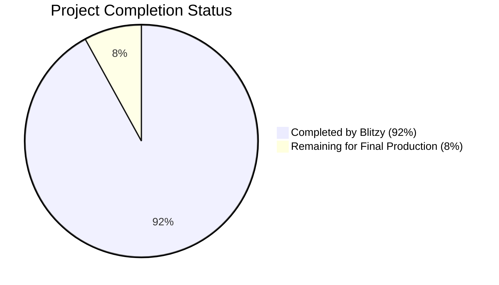
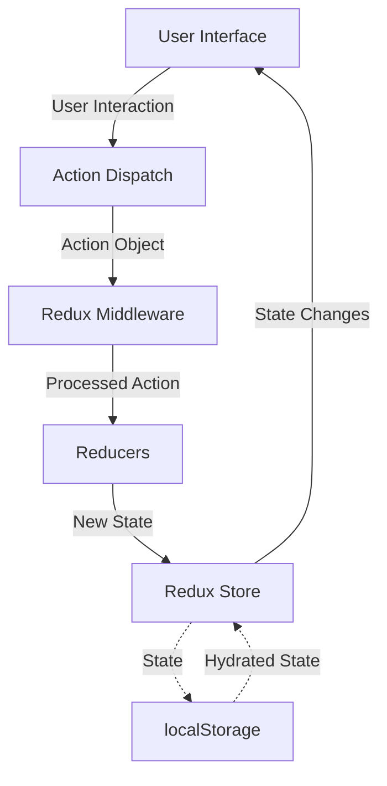
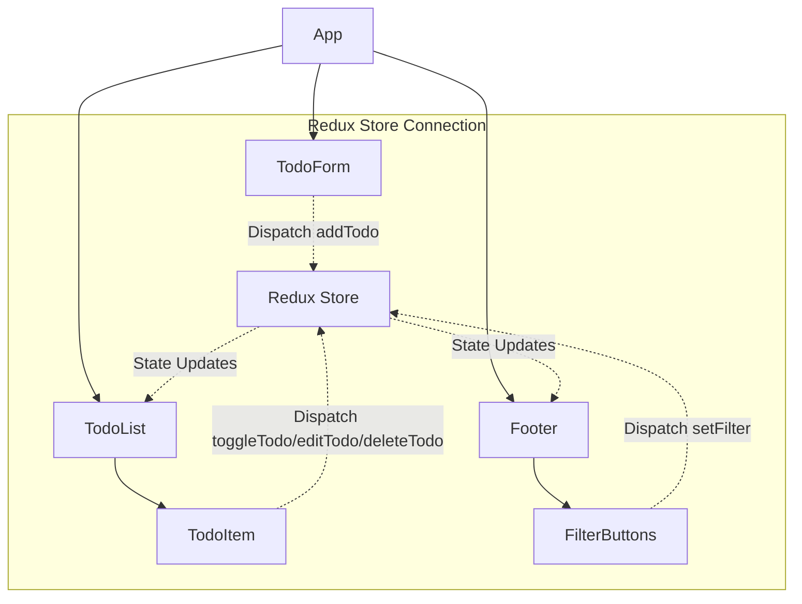

# PROJECT OVERVIEW

The **Redux Todo List** is a full-featured task management application built with React and Redux, offering comprehensive todo management capabilities with a modern, responsive user interface.

## Purpose and Functionality

This application provides users with an intuitive, persistent task tracking solution to efficiently organize, filter, and manage their todos in a browser environment. Users can create, edit, delete, and toggle completion status of todo items while benefiting from real-time updates and local persistence.

Key functionality includes:
- Creating new todo items with validation
- Marking todos as complete/incomplete
- Editing existing todo text
- Deleting todos
- Filtering todos by status (All, Active, Completed)
- Persistent storage across browser sessions

## Technical Architecture

The application is architected using modern front-end practices:

- **React (TypeScript)**: For component-based UI development with type safety
- **Redux Toolkit**: For predictable state management and simplified Redux logic
- **React-Redux**: For efficient component connections to the Redux store
- **LocalStorage API**: For client-side data persistence without a backend
- **CSS3**: For responsive styling and design

## Core Components

The application is structured around these key components:

1. **Redux Store**: Central state management with todo and filter slices
2. **Todo Components**: 
   - TodoForm for creating new items
   - TodoList for displaying filtered items
   - TodoItem for individual todo interaction
   - Footer for displaying counts and filter controls
3. **Services**:
   - LocalStorage middleware for data persistence
   - Validation utilities for form input checking

## User Experience

The interface provides a clean, minimalist design that:
- Works across mobile, tablet, and desktop screen sizes
- Provides clear visual feedback for actions
- Displays realtime counts of remaining items
- Preserves user data between sessions
- Validates input to ensure data quality

## Development Approach

The project follows modern development practices:
- TypeScript for type safety
- Functional components with React hooks
- Test-driven development with Jest and React Testing Library
- Comprehensive error handling and validation
- Responsive design principles
- Accessibility considerations

This Todo List application demonstrates a production-quality implementation of a client-side React/Redux application with a focus on user experience, code quality, and maintainability.

# PROJECT STATUS

## Project Completion Overview



## Project Metrics

| Metric | Value |
|--------|-------|
| Estimated Engineering Hours | 150 hours |
| Hours Completed by Blitzy | 138 hours |
| Hours Remaining | 12 hours |
| Completion Percentage | 92% |

## Completed Components

✅ **Core Redux Implementation**
- Redux store configuration with Redux Toolkit
- Todo slice with CRUD operations
- Filter slice for todo filtering
- Memoized selectors for efficient state access
- LocalStorage middleware for persistence

✅ **UI Components**
- TodoForm component with validation
- TodoList component with filtering
- TodoItem component with edit/delete/toggle functionality
- Footer component with filter controls and counts
- Responsive layout implementation
- Accessibility considerations

✅ **Utilities & Services**
- LocalStorage persistence service
- Input validation utilities
- Error handling implementation
- React custom hooks

✅ **Testing Framework**
- Unit tests for Redux reducers and selectors
- Component tests with React Testing Library
- Cypress E2E test configuration

✅ **Build & Deployment**
- CI/CD workflow configuration
- Build script optimization
- Static hosting configuration

## Remaining Tasks

⏳ **Testing Enhancements**
- Increase test coverage for edge cases (4 hours)
- Implement additional E2E test scenarios (2 hours)

⏳ **Final Optimizations**
- Performance optimization for larger todo lists (3 hours)
- Bundle size optimization (1 hour)

⏳ **Documentation & Polish**
- Complete user documentation (1 hour)
- Final code review and refactoring (1 hour)

## Next Steps

1. Complete remaining automated tests to reach 90%+ coverage
2. Implement performance optimizations for handling large todo lists
3. Finalize documentation for developers and end users
4. Final review and deployment to production

The React/Redux Todo List application is in the final stages of development with all core features implemented and functional. The remaining work focuses on optimization, testing enhancements, and polishing the documentation before final production release.

# TECHNOLOGY STACK

## Core Technologies

### Programming Languages and Frameworks

| Technology | Version | Purpose | Description |
|------------|---------|---------|-------------|
| TypeScript | 4.x+ | Primary language | Strongly-typed superset of JavaScript that enhances code quality and developer experience through static typing |
| React | 18.x | UI framework | Component-based library for building interactive user interfaces with efficient rendering through the Virtual DOM |
| Redux | 4.x | State management | Predictable state container providing a centralized store for application state with unidirectional data flow |
| Redux Toolkit | 1.9.x | Redux enhancement | Official toolset for efficient Redux development that simplifies common tasks and reduces boilerplate code |
| CSS3 | - | Styling | Modern styling capabilities with responsive design features and cross-browser compatibility |

### Supporting Libraries and Utilities

| Library | Version | Purpose | Description |
|---------|---------|---------|-------------|
| react-redux | 8.x | Redux integration | Official React bindings for Redux, providing optimized component connections to the Redux store |
| nanoid | 4.0.0 | ID generation | Lightweight utility for generating unique identifiers for todo items |
| immer | (included in Redux Toolkit) | Immutable state | Allows writing simpler immutable update logic by working with "draft" states |
| classnames | (used internally) | CSS class management | Utility for conditionally joining CSS class names, simplifying dynamic styling |

## State Management Architecture

The application follows a unidirectional data flow pattern with Redux at its core:



### Redux Implementation

The Redux store is structured with two primary slices:

1. **Todos Slice** - Manages the collection of todo items with the following actions:
   - `addTodo`: Creates a new todo with unique ID and initial incomplete status
   - `toggleTodo`: Switches a todo's completion status
   - `editTodo`: Updates the text content of an existing todo
   - `deleteTodo`: Removes a todo from the collection

2. **Filters Slice** - Manages the active filter selection:
   - `setFilter`: Updates the current filter (All, Active, Completed)

Each slice utilizes Redux Toolkit's `createSlice` API to define reducers and automatically generate action creators and action types.

## Client-Side Storage

The application uses the browser's localStorage API for client-side persistence:

| Storage Key | Content | Purpose |
|-------------|---------|---------|
| `todoApp.todos` | Serialized todo items | Persists the collection of tasks between sessions |
| `todoApp.filter` | Current filter setting | Remembers the user's last applied filter |

The storage implementation includes:
- **Throttling** to prevent excessive writes during rapid state changes
- **Error handling** for quotas, parsing failures, and unavailable storage
- **Serialization/deserialization** of state with JSON

## Type System

TypeScript provides comprehensive type safety throughout the application:

```typescript
// Core data types
interface Todo {
  id: string;
  text: string;
  completed: boolean;
}

enum FilterStatus {
  All = 'all',
  Active = 'active',
  Completed = 'completed'
}

// State structure types
interface TodosState {
  entities: Todo[];
}

interface FiltersState {
  status: FilterStatus;
}

// Combined Root State
interface RootState {
  todos: TodosState;
  filters: FiltersState;
}
```

## Form Validation

The application implements client-side validation for todo entries with the following rules:

| Validation Rule | Constraint | Error Message |
|-----------------|------------|---------------|
| Non-empty | Text must not be empty | "Todo text cannot be empty" |
| Maximum Length | Text cannot exceed 200 characters | "Todo text cannot exceed 200 characters" |
| Content Quality | Text cannot be only whitespace | "Todo text cannot be only whitespace" |

Validation is consistently applied throughout the application in both creation and editing operations.

## UI Component Structure



Each component is implemented as a functional component with React hooks for state management and Redux integration.

## Development and Build Tools

| Tool | Purpose | Configuration |
|------|---------|---------------|
| Create React App / Vite | Project scaffolding and build configuration | TypeScript template with modern ES features |
| ESLint | Code quality and style enforcement | Extended TypeScript and React recommended configs |
| Prettier | Code formatting | Configured for consistent styling across the codebase |
| Jest | Unit and integration testing | Config includes TypeScript support and code coverage reports |
| React Testing Library | Component testing | Used for testing components in isolation and integration |
| Cypress | End-to-end testing | Tests user flows and application functionality in real browser environments |

## Browser Compatibility

The application is designed to work on modern browsers with the following minimum versions:

| Browser | Minimum Version | Notes |
|---------|----------------|-------|
| Chrome | 60+ | Full support |
| Firefox | 60+ | Full support |
| Safari | 11+ | Full support |
| Edge | 16+ | Full support |
| Mobile browsers | iOS 11+, Android 5+ | Optimized with responsive design |

## Deployment Options

The application can be deployed to various static hosting platforms:

| Platform | Configuration | Benefits |
|----------|---------------|----------|
| Netlify | Configuration in `infrastructure/netlify.toml` | Free tier, automatic HTTPS, CI/CD integration |
| Vercel | Configuration in `infrastructure/vercel.json` | Free tier, optimized for React apps, preview deployments |
| AWS S3 + CloudFront | Configurations in infrastructure directory | Scalable, reliable with global CDN distribution |
| GitHub Pages | Standard static deployment | Free for public repositories, simple setup |

## Performance Considerations

The application implements several performance optimizations:

- **Memoized selectors** using Redux Toolkit's `createSelector` to prevent unnecessary calculations
- **Component memoization** with React.memo to prevent unnecessary re-renders
- **Throttled localStorage updates** to reduce write operations during rapid state changes
- **Efficient list rendering** with proper key usage for React reconciliation

# PREREQUISITES

Before setting up the Todo List Application, ensure your system meets the following requirements:

## System Requirements

- **Node.js**: v16.x or higher
  - Required for running the application and build tools
  - Download from [https://nodejs.org/](https://nodejs.org/)

- **Package Manager**: npm 8+ or Yarn 1.22+
  - npm comes bundled with Node.js
  - Yarn can be installed via npm: `npm install -g yarn`

## Development Environment

For the best development experience, we recommend:

- A modern code editor like Visual Studio Code
- Browser extensions for React Developer Tools and Redux DevTools
- Git for version control

## Browser Compatibility

The application is designed to work on:

- Chrome 60+
- Firefox 60+
- Safari 11+
- Edge 16+
- Mobile Safari (iOS 11+)
- Chrome for Android 60+

## Getting Started

To set up the project locally, follow these steps:

1. Clone the repository:
   ```bash
   git clone https://github.com/username/todo-list-app.git
   cd todo-list-app
   ```

2. Install dependencies:
   ```bash
   npm install
   # Or with yarn
   yarn install
   ```

3. Start the development server:
   ```bash
   npm start
   # Or with yarn
   yarn start
   ```

4. The application will be available at http://localhost:3000

## Available Scripts

- `npm start` - Starts the development server
- `npm test` - Runs the test suite
- `npm run build` - Builds the app for production
- `npm run test -- --coverage` - Runs tests with coverage reporting

# QUICK START

This section provides you with everything you need to quickly set up and start using the Todo List application.

## Prerequisites

To work with the Todo List application, you'll need:

- **Node.js**: v16.x or higher
- **npm**: 8+ or **Yarn**: 1.22+
- A modern web browser (Chrome, Firefox, Safari, or Edge)

## Installation

1. **Clone the repository**:

```bash
git clone https://github.com/username/todo-list-app.git
cd todo-list-app
```

2. **Install dependencies**:

Using npm:
```bash
npm install
```

Or with Yarn:
```bash
yarn install
```

## Running the Application

### Development Mode

Start the development server with:

```bash
npm start
# or with Yarn
yarn start
```

The application will be available at [http://localhost:3000](http://localhost:3000)

### Testing

Run the test suite with:

```bash
npm test
# or with Yarn
yarn test
```

For test coverage reporting:

```bash
npm test -- --coverage
# or with Yarn
yarn test --coverage
```

### Building for Production

Create a production build with:

```bash
npm run build
# or with Yarn
yarn build
```

The production files will be generated in the `build/` directory.

## Core Features

- **Create todos**: Enter text in the input field and press Enter
- **Complete todos**: Click the checkbox next to a todo to mark it complete/incomplete
- **Edit todos**: Double-click on a todo's text to edit it
- **Delete todos**: Click the (×) button that appears when hovering over a todo
- **Filter todos**: Use the footer controls to filter by All, Active, or Completed status
- **Persistence**: Your todos are automatically saved to localStorage between sessions

## Project Structure

The application follows a feature-based structure using Redux Toolkit patterns:

```
src/
├── app/                  # Redux store configuration
├── features/             # Feature modules
│   ├── todos/            # Todo management
│   └── filters/          # Filter management
├── components/           # UI components
├── utils/                # Utility functions
│   ├── localStorage.ts   # Persistence utilities
│   └── validation.ts     # Form validation
└── configs/              # Application configuration
```

## Deployment

The application can be deployed to any static hosting service:

- **Netlify**: Configuration in `infrastructure/netlify.toml`
- **Vercel**: Configuration in `infrastructure/vercel.json`
- **GitHub Pages**: Can be deployed directly from repository
- **AWS S3 + CloudFront**: Configurations provided in the infrastructure directory

## Next Steps

- Explore the codebase to understand the implementation details
- Check out the test files to understand how features are tested
- Review Redux store implementation to understand state management
- Experiment with modifying or extending the application

# Project Structure

The Todo List application follows a modern, feature-based organization pattern that separates concerns and enhances maintainability. The application is built with React, Redux, TypeScript, and leverages Redux Toolkit for efficient state management and localStorage for client-side persistence.

## Directory Structure

The project is organized with a feature-based approach, separating concerns by functionality rather than technical type:

```
todo-app/
├── src/
│   ├── app/                      # Core application configuration
│   │   ├── hooks.ts              # Custom React-Redux hooks
│   │   └── store.ts              # Redux store configuration
│   ├── features/                 # Feature modules
│   │   ├── todos/                # Todo management feature
│   │   │   ├── todosSlice.ts     # Redux slice for todos
│   │   │   └── tests/           # Todo feature tests
│   │   └── filters/              # Filtering feature
│   │       ├── filtersSlice.ts   # Redux slice for filters
│   │       └── tests/            # Filter feature tests
│   ├── components/               # Reusable UI components
│   │   ├── TodoItem/             # Individual todo item
│   │   ├── TodoList/             # List of todos
│   │   ├── TodoForm/             # Form for creating todos
│   │   ├── Footer/               # Footer with filters and counts
│   │   └── ErrorBoundary/        # Error handling component
│   ├── utils/                    # Utility functions
│   │   ├── localStorage.ts       # LocalStorage persistence
│   │   └── validation.ts         # Input validation utilities
│   ├── types/                    # TypeScript type definitions
│   │   └── index.ts              # Centralized type definitions
│   ├── middleware/               # Redux middleware
│   │   └── localStorage.ts       # Middleware for state persistence
│   ├── configs/                  # Configuration files
│   │   ├── constants.ts          # Application constants
│   │   └── validation.config.ts  # Validation rules
│   ├── styles/                   # Global styles
│   │   ├── base.css              # Base styling
│   │   └── utilities.css         # Utility classes
│   ├── layouts/                  # Layout components
│   │   └── MainLayout.tsx        # Main application layout
│   ├── hooks/                    # Custom React hooks
│   │   ├── useValidation.ts      # Form validation hook
│   │   └── useLocalStorage.ts    # LocalStorage hook
│   ├── App.tsx                   # Root application component
│   └── index.tsx                 # Application entry point
├── public/                       # Static assets
├── scripts/                      # Build and deployment scripts
├── cypress/                      # End-to-end tests
├── infrastructure/               # Deployment configurations
└── .github/                      # GitHub workflows and templates
```

## Core Architectural Components

### State Management

The application uses Redux with Redux Toolkit for state management, featuring:

1. **Store Configuration** (`src/app/store.ts`):
   - Central Redux store with todos and filters reducers
   - localStorage persistence middleware
   - Redux DevTools integration for debugging
   - Typed state and dispatch for TypeScript safety

2. **Todo Slice** (`src/features/todos/todosSlice.ts`):
   - Manages todo items with actions for CRUD operations
   - Includes memoized selectors for filtering and counting
   - Validation integrated in action creators

3. **Filters Slice** (`src/features/filters/filtersSlice.ts`):
   - Manages filter state (All, Active, Completed)
   - Provides selectors for current filter

4. **Custom Hooks** (`src/app/hooks.ts`):
   - Type-safe hooks for accessing Redux state and dispatch
   - Simplifies component integration with Redux

### Component Architecture

The application follows a component-based architecture with clear separation of concerns:

1. **Root Components**:
   - `App.tsx` - Entry point that sets up Redux Provider and layout
   - `MainLayout.tsx` - Main application layout structure

2. **Feature Components**:
   - `TodoForm` - Input form for creating new todos
   - `TodoList` - Container for rendering filtered todos
   - `TodoItem` - Individual todo with editing/completion functionality
   - `Footer` - Filter controls and status information

3. **Cross-Cutting Components**:
   - `ErrorBoundary` - Catches and handles runtime errors

### Data Persistence

The application utilizes localStorage for client-side persistence:

1. **LocalStorage Service** (`src/utils/localStorage.ts`):
   - Functions for saving/loading state to/from localStorage
   - Error handling for storage unavailability
   - Fallbacks for data corruption

2. **Persistence Middleware** (`src/middleware/localStorage.ts`):
   - Automatically persists state changes to localStorage
   - Implements throttling to prevent excessive writes
   - Handles storage errors gracefully

### Validation

Input validation is implemented throughout the application:

1. **Validation Utilities** (`src/utils/validation.ts`):
   - Reusable validation functions for todo text
   - Error message generation
   - Integrated with form components and Redux actions

2. **Validation Hook** (`src/hooks/useValidation.ts`):
   - Custom hook for form validation
   - Manages validation state and error messages

## Data Flow

The application follows a unidirectional data flow pattern:

1. **User Interaction** → User interacts with a component (e.g., adds a todo)
2. **Action Dispatch** → Component dispatches an action (e.g., `addTodo`)
3. **Reducer Processing** → Todo reducer processes the action and updates state
4. **State Update** → Redux store updates with new state
5. **Component Re-rendering** → Connected components re-render with new data
6. **Persistence** → localStorage middleware persists the updated state

This pattern ensures predictable state management and makes the application easier to debug and maintain.

## Key Files and Their Purpose

| File | Purpose |
|------|---------|
| `src/app/store.ts` | Configures Redux store with reducers and middleware |
| `src/features/todos/todosSlice.ts` | Defines todo state shape, actions, and reducers |
| `src/features/filters/filtersSlice.ts` | Manages filtering state and actions |
| `src/components/TodoItem/TodoItem.tsx` | Renders individual todo with edit/complete functionality |
| `src/components/TodoList/TodoList.tsx` | Renders filtered list of TodoItems |
| `src/components/TodoForm/TodoForm.tsx` | Handles todo creation with validation |
| `src/utils/localStorage.ts` | Manages localStorage persistence |
| `src/utils/validation.ts` | Provides validation utilities for todo text |
| `src/middleware/localStorage.ts` | Redux middleware for automatic state persistence |
| `src/types/index.ts` | Centralizes TypeScript type definitions |

## Testing Organization

The project's testing structure follows the source code organization:

- **Unit Tests** - Co-located with implementation files (`*.test.ts[x]`)
- **Feature Tests** - Located in feature-specific test directories
- **End-to-End Tests** - Located in the `cypress` directory

## Deployment Configuration

Deployment configuration files are located in the `infrastructure` directory, supporting multiple deployment options:

- Vercel (`infrastructure/vercel.json`)
- Netlify (`infrastructure/netlify.toml`)
- AWS S3 + CloudFront (`infrastructure/cloudfront-distribution.json`, `infrastructure/s3-bucket-policy.json`)

CI/CD workflows are defined in the `.github/workflows` directory, providing automation for:
- Building and testing on pull requests
- Continuous deployment to staging and production environments
- Running end-to-end tests before production deployment

## Dependencies and Tools

The project uses several key tools and libraries:

- **React** (18.x) - UI library
- **Redux** (4.x) - State management
- **Redux Toolkit** (1.9.x) - Simplified Redux development
- **TypeScript** - Static type checking
- **nanoid** - Unique ID generation for todos
- **classnames** - Conditional class name management
- **react-transition-group** - Animation effects for todo list items
- **Jest & React Testing Library** - Testing framework
- **Cypress** - End-to-end testing
- **ESLint & Prettier** - Code quality and formatting

This structure supports a maintainable, scalable application with clear separation of concerns, strong type safety, and comprehensive testing.

# CODE GUIDE

## Introduction

This is a comprehensive guide to the Todo List application codebase. This application is built using React, Redux with Redux Toolkit, TypeScript, and localStorage for persistence. It implements a feature-based architecture with clear separation of concerns.

The application follows modern best practices for React development, using functional components with hooks, Redux for state management, and TypeScript for type safety.

## Project Structure

The project follows a feature-based structure, organized into logical folders:

```
src/
├── web/
│   ├── app/               # Redux store configuration and shared hooks
│   ├── components/        # React UI components
│   ├── configs/           # Application configurations and constants
│   ├── features/          # Feature modules (todos, filters) with their Redux slices
│   ├── hooks/             # Custom React hooks
│   ├── layouts/           # Layout components for page structure
│   ├── middleware/        # Redux middleware
│   ├── public/            # Public assets
│   ├── styles/            # Global CSS styles
│   ├── types/             # TypeScript type definitions
│   ├── utils/             # Utility functions
│   ├── App.tsx            # Main application component
│   └── index.tsx          # Application entry point
```

## Key Folders and Files Explained

### src/web/types

This folder contains TypeScript type definitions used throughout the application:

- **index.ts**: Defines interfaces and types for the entire application, including:
  - `Todo`: Represents a single todo item with id, text, and completed status
  - `TodosState`: Represents the todos slice in the Redux store
  - `FilterStatus`: Enum for the possible filter states (All, Active, Completed)
  - `FiltersState`: Represents the filters slice in the Redux store
  - `RootState`: The root state structure of the Redux store
  - `ValidationResult`: For form validation results
  - `LocalStorageState`: Structure for data saved in localStorage

These types ensure type safety across the application and help with code completion in your IDE.

### src/web/configs

Contains configuration files and constants:

- **constants.ts**: Defines application constants like:
  - Storage keys for localStorage
  - CSS class names
  - Test IDs for component testing
  - UI text constants
  - Default values
  - Filter options
  - Keyboard key constants

- **validation.config.ts**: Contains validation rules and configuration for form inputs, including:
  - Maximum and minimum length for todo text
  - Error messages for validation failures
  - Validation patterns

Using centralized constants makes it easier to maintain the application and avoid magic strings throughout the codebase.

### src/web/app

Core Redux setup and application-wide hooks:

- **store.ts**: Configures the Redux store using Redux Toolkit:
  - Combines reducers for todos and filters
  - Sets up localStorage middleware
  - Loads initial state from localStorage
  - Configures Redux DevTools
  - Exports TypeScript types for the store

- **hooks.ts**: Provides typed hooks for accessing the Redux store:
  - `useAppDispatch`: For dispatching actions with correct typing
  - `useAppSelector`: For selecting state from the store with correct typing

These hooks ensure type safety when interacting with Redux throughout the application.

### src/web/features

Contains feature modules organized by domain. Each feature has its own Redux slice:

#### features/todos

Manages todo items:

- **todosSlice.ts**: Redux Toolkit slice for todo items:
  - Actions: `addTodo`, `toggleTodo`, `editTodo`, `deleteTodo`
  - Selectors: `selectAllTodos`, `selectFilteredTodos`, `selectActiveTodoCount`, `selectCompletedTodoCount`
  - Reducers for handling each action
  - Initial state loading from localStorage

#### features/filters

Manages filtering of todo items:

- **filtersSlice.ts**: Redux Toolkit slice for filters:
  - Actions: `setFilter`
  - Selectors: `selectCurrentFilter`
  - Reducer for updating the filter state
  - Initial state with default filter (usually 'all')

This feature-based organization groups related functionality together, making the codebase more maintainable.

### src/web/components

Contains React UI components organized into folders by component:

#### components/TodoForm

- **TodoForm.tsx**: Renders the form for creating new todos:
  - Manages form state using custom validation hook
  - Handles form submission and input validation
  - Dispatches `addTodo` action when valid
  - Shows validation errors when needed
  - Provides keyboard navigation (Escape to clear)

- **TodoForm.css**: Component-specific styles

#### components/TodoList

- **TodoList.tsx**: Renders the list of todo items:
  - Uses `selectFilteredTodos` to get todos filtered by current filter
  - Renders the `TodoItem` component for each todo
  - Handles empty state display
  - Implements animations for items using `react-transition-group`

- **TodoList.css**: Component-specific styles including animations

#### components/TodoItem

- **TodoItem.tsx**: Renders an individual todo item:
  - Handles view and edit modes
  - Manages completion toggling, editing, and deletion
  - Implements keyboard navigation (Enter to save, Escape to cancel)
  - Shows validation errors for edits
  - Applies appropriate CSS classes based on state

- **TodoItem.css**: Component-specific styles for different item states

#### components/Footer

- **Footer.tsx**: Renders the footer with filter controls:
  - Shows count of active todo items
  - Provides filter buttons for All, Active, and Completed
  - Highlights the currently active filter
  - Only renders when there are todos

- **Footer.css**: Component-specific styles for the footer

#### components/ErrorBoundary

- **ErrorBoundary.tsx**: Error boundary component:
  - Catches errors in component tree
  - Displays fallback UI when errors occur
  - Logs errors for debugging
  - Prevents application crashes

These components follow a consistent pattern and are well-organized, making them easy to understand and maintain.

### src/web/utils

Contains utility functions used across the application:

- **localStorage.ts**: Functions for interacting with localStorage:
  - `saveState`: Persists entire application state
  - `loadState`: Loads entire application state
  - `saveTodos`: Persists only the todos slice
  - `loadTodos`: Loads only the todos slice
  - `saveFilter`: Persists only the filter slice
  - `loadFilter`: Loads only the filter slice
  - `clearStorage`: Removes all application data
  - `isStorageAvailable`: Checks if localStorage is available

- **validation.ts**: Functions for validating user input:
  - `validateTodoText`: Validates todo text against configured rules
  - Checks for empty text, whitespace-only, and length limits
  - Returns validation result with isValid flag and error message

These utility functions encapsulate common functionality and ensure consistent behavior across the application.

### src/web/middleware

Contains Redux middleware:

- **localStorage.ts**: Redux middleware for localStorage persistence:
  - Listens for state changes in Redux
  - Automatically persists relevant state to localStorage
  - Implements throttling to prevent excessive writes
  - Handles storage errors gracefully

This middleware ensures that the application state is automatically synchronized with localStorage without requiring explicit calls in components.

### src/web/hooks

Contains custom React hooks:

- **useValidation.ts**: Hook for form validation:
  - Manages input value state
  - Validates against specified rules
  - Tracks validation errors
  - Supports validation on change or on submit

- **useLocalStorage.ts**: Hook for localStorage interaction:
  - Wrapper around localStorage API
  - Handles serialization and deserialization
  - Provides type safety for stored values
  - Handles storage errors gracefully

These custom hooks encapsulate common logic and make it reusable across components.

### src/web/layouts

Contains layout components:

- **MainLayout.tsx**: Main application layout structure:
  - Provides consistent container and structure
  - Handles responsive layout adjustments
  - May include common elements like header/footer

- **MainLayout.css**: Layout-specific styles

Layouts separate structure from component implementation, making it easier to maintain consistent page structure.

### src/web/styles

Contains global CSS styles:

- **base.css**: Base styles for the entire application:
  - CSS reset/normalize
  - Global typography settings
  - Color variables and themes

- **utilities.css**: Utility classes:
  - Helper classes for common styling needs
  - Spacing utilities
  - Text alignment utilities

- **layout.css**: General layout styles:
  - Grid systems
  - Container definitions
  - Responsive breakpoints

These global styles ensure consistency across the application and avoid repetition in component-specific CSS.

## Core Application Flow

1. **Application Initialization**:
   - Application starts in `index.tsx`
   - Redux store is initialized in `store.ts`
   - Initial state is loaded from localStorage
   - React components render based on the initial state

2. **Adding a Todo**:
   - User enters text in `TodoForm`
   - Form validates input using `useValidation` hook
   - On submit, `addTodo` action is dispatched
   - `todosSlice` reducer adds the new todo to state
   - `localStorage` middleware persists the updated state
   - React re-renders the `TodoList` with the new item

3. **Toggling a Todo**:
   - User clicks checkbox in `TodoItem`
   - `toggleTodo` action is dispatched with todo ID
   - Reducer updates the completed status in state
   - State change triggers re-render with updated styling
   - Footer item count updates automatically

4. **Editing a Todo**:
   - User double-clicks todo text to enter edit mode
   - Input field shows current text and focuses
   - User edits text and presses Enter
   - Input is validated
   - If valid, `editTodo` action is dispatched
   - Reducer updates the todo text in state
   - Component returns to view mode with updated text

5. **Deleting a Todo**:
   - User clicks delete button on a todo item
   - `deleteTodo` action is dispatched with todo ID
   - Reducer removes the todo from state
   - List updates to remove the deleted item

6. **Filtering Todos**:
   - User clicks a filter button in Footer
   - `setFilter` action is dispatched with filter value
   - Filter state is updated in Redux
   - `selectFilteredTodos` selector filters todos based on current filter
   - TodoList re-renders with filtered items
   - Active filter button is highlighted

7. **Data Persistence**:
   - Redux middleware listens for state changes
   - When state changes, relevant portions are serialized
   - Serialized state is stored in localStorage
   - On application restart, state is loaded from localStorage

## Core Redux Flow

1. **Action Creation**:
   - Actions are defined in feature slices (todosSlice.ts, filtersSlice.ts)
   - Each action has a type and payload
   - Actions are dispatched from components using `useAppDispatch`

2. **Action Processing**:
   - Reducers in feature slices handle actions
   - Reducers update state immutably using Immer (via Redux Toolkit)
   - State is changed based on action payload

3. **State Selection**:
   - Components access state using selectors
   - Selectors are memoized using `createSelector` for performance
   - Components re-render only when relevant state changes
   - `useAppSelector` provides type-safe access to state

4. **Middleware Processing**:
   - Actions flow through middleware before reaching reducers
   - localStorage middleware persists state changes
   - Other middleware could handle side effects or logging

## Error Handling

1. **Form Validation**:
   - Input validation occurs in real-time or on submission
   - Validation errors are displayed inline
   - Prevents invalid data from reaching the Redux store

2. **localStorage Errors**:
   - Storage operations are wrapped in try/catch blocks
   - Falls back to in-memory operation if localStorage fails
   - Provides meaningful error messages in the console

3. **Component Errors**:
   - ErrorBoundary component catches rendering errors
   - Prevents entire application from crashing
   - Shows fallback UI when errors occur

## Testing Strategy

The codebase is designed for testability:

1. **Unit Tests**:
   - Tests for Redux reducers and selectors
   - Tests for utility functions like validation and localStorage

2. **Component Tests**:
   - Tests for individual React components
   - Mock Redux store for testing component behavior
   - Test different component states and user interactions

3. **Integration Tests**:
   - Tests for component integration with Redux
   - Tests for complete user flows

4. **End-to-End Tests**:
   - Tests entire application in a browser environment
   - Verifies that all features work together correctly

## Performance Optimizations

1. **Redux Selectors**:
   - Memoized selectors with `createSelector` prevent unnecessary calculations
   - Only re-renders components when relevant state changes

2. **React Optimizations**:
   - Functional components with hooks for better performance
   - Component memoization where appropriate
   - Key props for efficient list rendering

3. **localStorage Optimization**:
   - Throttled writes to prevent excessive storage operations
   - Selective persistence of only changed state portions

## Accessibility Considerations

1. **Keyboard Navigation**:
   - All interactive elements are keyboard accessible
   - Form submission with Enter key
   - Escape to cancel editing or clear form
   - Focus management for edit mode

2. **Screen Reader Support**:
   - Semantic HTML elements with appropriate roles
   - ARIA attributes for interactive elements
   - Error messages linked to corresponding inputs

3. **Visual Design**:
   - Sufficient color contrast for text
   - Visual indicators for focus states
   - Clear error messaging
   - Responsive design for different screen sizes

## Conclusion

This Todo List application demonstrates a well-structured React/Redux application with TypeScript. It follows modern best practices for organizing code, managing state, handling user input, and ensuring data persistence.

The feature-based architecture makes it easy to understand how different parts of the application work together, while the use of TypeScript ensures type safety throughout the codebase.

This application provides a solid foundation that could be extended with additional features like user authentication, backend integration, or more advanced todo management capabilities.

# DEVELOPMENT GUIDELINES

## Setting Up Your Development Environment

### Prerequisites
- Node.js (v16.x or higher)
- npm (v8.x or higher) or Yarn (v1.22.x or higher)
- Git

### Initial Setup
1. Clone the repository:
   ```bash
   git clone https://github.com/yourusername/todo-list-react-redux.git
   cd todo-list-react-redux
   ```

2. Install dependencies:
   ```bash
   npm install
   # or
   yarn install
   ```

3. Start the development server:
   ```bash
   npm start
   # or
   yarn start
   ```

4. The application will be available at `http://localhost:3000`

## Project Structure

```
todo-list-react-redux/
├── cypress/                  # End-to-end tests
├── infrastructure/           # Deployment configuration files
├── scripts/                  # Build and deployment scripts
├── src/
│   └── web/                  # Web application source code
│       ├── app/              # Redux store configuration
│       ├── assets/           # Static assets (images, fonts)
│       ├── components/       # Reusable UI components
│       ├── configs/          # Configuration constants
│       ├── features/         # Feature modules (todos, filters)
│       ├── hooks/            # Custom React hooks
│       ├── layouts/          # Layout components
│       ├── middleware/       # Redux middleware
│       ├── public/           # Public static files
│       ├── styles/           # Global CSS styles
│       ├── types/            # TypeScript type definitions
│       ├── utils/            # Utility functions
│       ├── App.tsx           # Main App component
│       ├── index.tsx         # Application entry point
│       └── package.json      # Project dependencies
├── .github/                  # GitHub configuration files
├── .gitignore                # Git ignore configuration
├── CONTRIBUTING.md           # Contribution guidelines
├── LICENSE                   # Project license
├── README.md                 # Project documentation
└── package.json              # Root package configuration
```

## Key Files
- `src/web/app/store.ts`: Redux store configuration
- `src/web/features/todos/todosSlice.ts`: Todo state management
- `src/web/features/filters/filtersSlice.ts`: Filter state management
- `src/web/utils/localStorage.ts`: LocalStorage persistence utilities
- `src/web/components/`: React components for todos, forms, and filters

## Coding Standards

### TypeScript Guidelines
- Use TypeScript for all new code
- Define explicit types for props, state, and function parameters
- Avoid using `any` type; use proper type definitions
- Use interfaces for object shapes and types for unions/primitives

### React Best Practices
- Use functional components with hooks instead of class components
- Keep components small and focused on a single responsibility
- Use the React Testing Library for component tests
- Implement proper error boundaries for fault tolerance

### Redux Guidelines
- Follow Redux Toolkit patterns for all state management
- Use slice files to organize reducers and actions
- Implement selectors for accessing state
- Use the Redux DevTools extension for debugging

### CSS Guidelines
- Use component-scoped CSS files (e.g., `Component.css`)
- Follow BEM (Block Element Modifier) naming convention
- Prioritize responsive design in all styles
- Use variables for colors, spacing, and typography

## Testing Strategy

### Unit Tests
- Write tests for all Redux reducers, actions, and selectors
- Test React components in isolation
- Use Jest and React Testing Library
- Run unit tests with:
  ```bash
  npm test
  # or
  yarn test
  ```

### End-to-End Tests
- Use Cypress for E2E testing
- Test complete user flows
- Run E2E tests with:
  ```bash
  npm run cy:run
  # or
  yarn cy:run
  ```

### Test Coverage
- Aim for minimum 80% code coverage
- Run coverage report:
  ```bash
  npm test -- --coverage
  # or
  yarn test --coverage
  ```

## Build and Deployment

### Development Build
```bash
npm start
# or
yarn start
```

### Production Build
```bash
npm run build
# or
yarn build
```

### Deployment
The application can be deployed to various platforms:

1. **Netlify**:
   - Automatic deployment via GitHub integration
   - Configuration in `infrastructure/netlify.toml`

2. **Vercel**:
   - Automatic deployment via GitHub integration
   - Configuration in `infrastructure/vercel.json`

3. **AWS S3/CloudFront**:
   - Manual deployment using the deploy script
   - Configuration in `infrastructure/` directory
   ```bash
   npm run deploy
   # or
   yarn deploy
   ```

## Git Workflow

### Branch Naming Convention
- Feature branches: `feature/short-description`
- Bug fixes: `fix/issue-description`
- Hotfixes: `hotfix/critical-issue`
- Releases: `release/version-number`

### Commit Messages
- Use present tense ("Add feature" not "Added feature")
- First line should be concise summary
- Include issue numbers in commit message where applicable
- Example: `feat: add todo filtering functionality (#42)`

### Pull Request Process
1. Create a branch from `main`
2. Make your changes and test them
3. Push your branch and create a Pull Request
4. Use the PR template provided
5. Request reviews from team members
6. CI checks must pass before merging

## Performance Considerations

1. **State Management**:
   - Use memoized selectors for derived data
   - Avoid storing computed values in Redux
   - Use `React.memo()` for pure components

2. **Rendering Optimization**:
   - Implement virtualization for large todo lists
   - Use keys properly for efficient list rendering
   - Avoid unnecessary re-renders

3. **LocalStorage**:
   - Throttle persistence operations to avoid performance impact
   - Handle storage limits gracefully
   - Implement fallback for localStorage failures

## Troubleshooting

### Common Issues

1. **Build Failures**:
   - Check Node.js version (use v16+)
   - Clear node_modules and reinstall: `rm -rf node_modules && npm install`
   - Check for TypeScript errors: `npm run tsc`

2. **Test Failures**:
   - Ensure test environment is properly set up
   - Check for snapshot mismatches: `npm test -- -u`
   - Isolate failing tests: `npm test -- -t "test name"`

3. **Redux Issues**:
   - Use Redux DevTools to debug state issues
   - Check action payloads and reducer logic
   - Verify correct store connection in components

4. **LocalStorage Issues**:
   - Check browser storage quota
   - Verify localStorage is enabled in the browser
   - Clear localStorage manually: `localStorage.clear()`

## Accessibility Guidelines

- Ensure all interactive elements are keyboard accessible
- Maintain proper heading hierarchy
- Use semantic HTML elements
- Include appropriate ARIA attributes where needed
- Test with screen readers
- Maintain contrast ratios per WCAG 2.1 AA standards

## Learning Resources

- [React Documentation](https://reactjs.org/docs/getting-started.html)
- [Redux Toolkit Documentation](https://redux-toolkit.js.org/introduction/getting-started)
- [TypeScript Handbook](https://www.typescriptlang.org/docs/handbook/intro.html)
- [Jest Testing Framework](https://jestjs.io/docs/getting-started)
- [Cypress Testing](https://docs.cypress.io/guides/overview/why-cypress)

# HUMAN INPUTS NEEDED

| Task | Description | Priority | Estimated Hours |
|------|-------------|----------|----------------|
| QA/Bug Fixes | Review codebase for compilation errors, dependency conflicts, and fix remaining issues. Ensure proper TypeScript typing throughout the application. | High | 8-12 |
| Redux Store Integration Testing | Verify that Redux actions, reducers, and selectors work correctly together. Test state persistence and hydration from localStorage. | High | 4-6 |
| Responsive UI Verification | Test application across mobile, tablet, and desktop viewports to ensure responsive design works as specified. Verify touch targets are appropriate for mobile. | High | 3-4 |
| Accessibility Implementation | Ensure application meets WCAG 2.1 AA standards. Add appropriate ARIA labels, keyboard navigation, and screen reader support. | High | 5-7 |
| Cross-Browser Testing | Test application functionality across Chrome, Firefox, Safari, and Edge to ensure consistent behavior. | Medium | 3-5 |
| End-to-End Test Completion | Complete Cypress test implementations for core user flows (adding, editing, completing, filtering todos). | Medium | 4-6 |
| Performance Optimization | Implement React.memo for components and createSelector for Redux selectors to optimize rendering performance. | Medium | 2-3 |
| LocalStorage Error Handling | Enhance localStorage implementation with proper error handling for quota exceeded and corrupted data scenarios. | Medium | 2-3 |
| CI/CD Pipeline Configuration | Set up GitHub Actions workflows for testing, building, and deployment to the selected hosting platform. | Medium | 3-4 |
| Documentation Updates | Update README.md with accurate setup, development, and deployment instructions. Add JSDoc comments to key functions. | Low | 2-3 |
| Form Validation Enhancement | Review and enhance form validation for edge cases and internationalization support. | Low | 1-2 |
| Static Analysis Setup | Configure ESLint, Prettier, and TypeScript settings for optimal code quality enforcement. | Low | 2-3 |
| Dependency Audit | Audit and update third-party dependencies, resolve any security vulnerabilities. | Medium | 1-2 |
| Deployment Configuration | Configure hosting platform settings (Netlify/Vercel/AWS) based on infrastructure files. | Medium | 2-3 |