# Technical Specifications

## 1. INTRODUCTION

### EXECUTIVE SUMMARY

| Aspect | Description |
|--------|-------------|
| Project Overview | A full-featured Todo List application built with React and Redux, offering comprehensive task management capabilities with a modern user interface. |
| Business Problem | Addresses the need for a reliable, persistent task tracking solution that allows users to efficiently manage, filter, and interact with their tasks in a responsive web environment. |
| Key Stakeholders | • End users seeking task management<br>• Development team<br>• Product managers<br>• UX/UI designers |
| Value Proposition | Delivers a streamlined, intuitive task management experience with real-time updates, persistent storage, and responsive design—ensuring users can organize their tasks effectively across different devices. |

### SYSTEM OVERVIEW

#### Project Context

| Aspect | Details |
|--------|---------|
| Business Context | The application fills the need for lightweight, accessible task management tools in an increasingly digital productivity landscape. |
| Current Limitations | Traditional paper-based methods or basic digital lists lack filtering, persistence, and editing capabilities. |
| Integration Landscape | Designed as a standalone application with potential for future API integration with calendar systems or productivity suites. |

#### High-Level Description

The Todo List application employs modern React architecture combined with Redux state management to deliver a responsive and interactive task management solution.

| Component | Description |
|-----------|-------------|
| Primary Capabilities | • Task creation, editing, deletion, and completion tracking<br>• Task filtering by status (All, Active, Completed)<br>• Persistent storage across sessions |
| Key Architecture | • React component-based frontend<br>• Redux state management using Redux Toolkit<br>• Responsive CSS for cross-device compatibility |
| Major Components | • Redux store with todo slice<br>• Todo item components<br>• Filtering system<br>• Form components with validation<br>• Status footer |
| Technical Approach | • Modern React functional components with hooks<br>• Redux Toolkit for simplified state management<br>• LocalStorage for client-side persistence |

#### Success Criteria

| Criteria Type | Metrics |
|---------------|---------|
| Measurable Objectives | • Zero data loss between sessions<br>• Sub-second response time for all CRUD operations<br>• Proper functionality across all modern browsers |
| Critical Factors | • Intuitive UX requiring no tutorial<br>• Reliable task persistence<br>• Accurate filtering system |
| KPIs | • Task completion rate<br>• User engagement time<br>• Error-free form submissions |

### SCOPE

#### In-Scope

| Category | Elements |
|----------|----------|
| Core Features | • Complete Redux store implementation with Redux Toolkit<br>• Todo creation, editing, completion, and deletion<br>• Status filtering (All, Active, Completed)<br>• Form validation for todo entries<br>• LocalStorage persistence<br>• Responsive UI design |
| Implementation Boundaries | • Client-side processing only<br>• Modern browser support (Chrome, Firefox, Safari, Edge)<br>• Support for desktop and mobile viewports<br>• English language interface |

#### Out-of-Scope

| Category | Elements |
|----------|----------|
| Excluded Features | • User authentication and multi-user support<br>• Backend server implementation<br>• Cloud synchronization across devices<br>• Due dates and reminders<br>• Categories and tags beyond basic status filters |
| Future Considerations | • API integration with other productivity tools<br>• Offline functionality with service workers<br>• Task prioritization beyond list order<br>• Recurring task functionality<br>• Data export/import capabilities |

## 2. PRODUCT REQUIREMENTS

### FEATURE CATALOG

#### F-001: Redux Store Implementation

| Metadata | Details |
|----------|---------|
| Feature Name | Redux Store Implementation |
| Feature Category | State Management |
| Priority Level | Critical |
| Status | Proposed |

**Description:**
- **Overview**: Complete Redux store implementation using Redux Toolkit as the state management solution for the Todo application.
- **Business Value**: Provides predictable state management, enabling reliable task tracking and application functionality.
- **User Benefits**: Ensures consistent experience with instant updates to the UI when tasks are modified.
- **Technical Context**: Forms the foundation for state management across the entire application.

**Dependencies:**
- **Prerequisite Features**: None
- **System Dependencies**: React environment
- **External Dependencies**: Redux Toolkit library
- **Integration Requirements**: Must integrate with all React components that require state access

#### F-002: Todo Management Actions

| Metadata | Details |
|----------|---------|
| Feature Name | Todo Management Actions |
| Feature Category | Core Functionality |
| Priority Level | Critical |
| Status | Proposed |

**Description:**
- **Overview**: Implementation of a todo slice with actions for adding, deleting, editing, and toggling todo completion status.
- **Business Value**: Enables core task management functionality required for application usefulness.
- **User Benefits**: Allows users to create and manage their tasks with full CRUD capabilities.
- **Technical Context**: Leverages Redux Toolkit for simplified action creation and state updates.

**Dependencies:**
- **Prerequisite Features**: F-001 (Redux Store Implementation)
- **System Dependencies**: None
- **External Dependencies**: None
- **Integration Requirements**: Must integrate with todo item components and form components

#### F-003: Todo Filtering System

| Metadata | Details |
|----------|---------|
| Feature Name | Todo Filtering System |
| Feature Category | User Experience |
| Priority Level | High |
| Status | Proposed |

**Description:**
- **Overview**: Functionality to filter todos by three states: All, Active, and Completed.
- **Business Value**: Enhances usability by allowing users to focus on specific subsets of tasks.
- **User Benefits**: Reduces cognitive load by showing only relevant tasks based on user selection.
- **Technical Context**: Requires filter state management in the Redux store.

**Dependencies:**
- **Prerequisite Features**: F-001, F-002
- **System Dependencies**: None
- **External Dependencies**: None
- **Integration Requirements**: Must integrate with footer component and todo list display

#### F-004: Responsive UI Design

| Metadata | Details |
|----------|---------|
| Feature Name | Responsive UI Design |
| Feature Category | User Interface |
| Priority Level | High |
| Status | Proposed |

**Description:**
- **Overview**: Clean, responsive CSS styling that ensures proper display across device sizes.
- **Business Value**: Increases accessibility and usability across different devices.
- **User Benefits**: Provides consistent experience regardless of the device used to access the application.
- **Technical Context**: Uses CSS media queries and flexible layouts for responsiveness.

**Dependencies:**
- **Prerequisite Features**: None
- **System Dependencies**: Modern browser CSS support
- **External Dependencies**: None
- **Integration Requirements**: Must apply to all UI components

#### F-005: Form Validation

| Metadata | Details |
|----------|---------|
| Feature Name | Form Validation |
| Feature Category | Data Quality |
| Priority Level | Medium |
| Status | Proposed |

**Description:**
- **Overview**: Validation system for todo input to ensure quality data entry.
- **Business Value**: Prevents invalid data entry, maintaining data integrity.
- **User Benefits**: Provides immediate feedback on input errors, improving user experience.
- **Technical Context**: Implemented at the form component level with appropriate error handling.

**Dependencies:**
- **Prerequisite Features**: F-002
- **System Dependencies**: None
- **External Dependencies**: None
- **Integration Requirements**: Must integrate with todo creation and editing forms

#### F-006: LocalStorage Persistence

| Metadata | Details |
|----------|---------|
| Feature Name | LocalStorage Persistence |
| Feature Category | Data Management |
| Priority Level | High |
| Status | Proposed |

**Description:**
- **Overview**: System to persist todo items in browser localStorage between sessions.
- **Business Value**: Ensures user data retention without backend implementation.
- **User Benefits**: Preserves user's task list between browser sessions and page refreshes.
- **Technical Context**: Utilizes browser's localStorage API for client-side data persistence.

**Dependencies:**
- **Prerequisite Features**: F-001, F-002
- **System Dependencies**: Browser localStorage support
- **External Dependencies**: None
- **Integration Requirements**: Must integrate with Redux store for state persistence

#### F-007: Todo Item Components

| Metadata | Details |
|----------|---------|
| Feature Name | Todo Item Components |
| Feature Category | UI Components |
| Priority Level | Critical |
| Status | Proposed |

**Description:**
- **Overview**: React components for displaying and interacting with individual todo items.
- **Business Value**: Provides the visual interface for the core application functionality.
- **User Benefits**: Enables intuitive interaction with tasks through a clear interface.
- **Technical Context**: Reusable components that connect to the Redux store.

**Dependencies:**
- **Prerequisite Features**: F-001, F-002
- **System Dependencies**: None
- **External Dependencies**: None
- **Integration Requirements**: Must integrate with the Redux store and main application layout

#### F-008: Footer Component

| Metadata | Details |
|----------|---------|
| Feature Name | Footer Component |
| Feature Category | UI Components |
| Priority Level | Medium |
| Status | Proposed |

**Description:**
- **Overview**: Application footer displaying task counts and filtering options.
- **Business Value**: Provides at-a-glance metrics and filtering controls.
- **User Benefits**: Allows quick filtering and provides task completion status overview.
- **Technical Context**: Component that connects to Redux store for counts and filter management.

**Dependencies:**
- **Prerequisite Features**: F-001, F-003
- **System Dependencies**: None
- **External Dependencies**: None
- **Integration Requirements**: Must integrate with filtering system and main application layout

#### F-009: Component Organization

| Metadata | Details |
|----------|---------|
| Feature Name | Component Organization |
| Feature Category | Code Structure |
| Priority Level | Medium |
| Status | Proposed |

**Description:**
- **Overview**: Proper organization of components and files within the application structure.
- **Business Value**: Facilitates maintainability and future development.
- **User Benefits**: Indirectly benefits users through improved application stability and faster updates.
- **Technical Context**: Involves directory structure and file organization.

**Dependencies:**
- **Prerequisite Features**: All features (F-001 to F-008)
- **System Dependencies**: None
- **External Dependencies**: None
- **Integration Requirements**: Applies to entire codebase organization

#### F-010: Code Documentation

| Metadata | Details |
|----------|---------|
| Feature Name | Code Documentation |
| Feature Category | Development |
| Priority Level | Medium |
| Status | Proposed |

**Description:**
- **Overview**: Comments explaining code structure and functionality throughout the application.
- **Business Value**: Enables easier maintenance and onboarding of new developers.
- **User Benefits**: Indirectly benefits users through improved code quality and maintenance.
- **Technical Context**: Applies to all code files, with special attention to complex logic areas.

**Dependencies:**
- **Prerequisite Features**: All features (F-001 to F-009)
- **System Dependencies**: None
- **External Dependencies**: None
- **Integration Requirements**: Applies to all code files

### FUNCTIONAL REQUIREMENTS TABLE

#### Redux Store Implementation (F-001)

| Requirement ID | Description | Acceptance Criteria | Priority |
|----------------|-------------|---------------------|----------|
| F-001-RQ-001 | Configure Redux store using Redux Toolkit | Store initializes without errors and is accessible via React-Redux hooks | Must-Have |
| F-001-RQ-002 | Implement Redux DevTools integration | Redux DevTools shows state transitions and actions | Should-Have |
| F-001-RQ-003 | Create reducers using createSlice | Reducers properly handle state transitions for all operations | Must-Have |
| F-001-RQ-004 | Export actions and selectors | Actions and selectors can be imported and used by components | Must-Have |

**Technical Specifications:**
- **Input Parameters**: Initial state configuration
- **Output/Response**: Configured Redux store object
- **Performance Criteria**: Sub-100ms initialization time
- **Data Requirements**: Must support todo items array with completion state

**Validation Rules:**
- **Business Rules**: N/A
- **Data Validation**: N/A
- **Security Requirements**: N/A
- **Compliance Requirements**: N/A

#### Todo Management Actions (F-002)

| Requirement ID | Description | Acceptance Criteria | Priority |
|----------------|-------------|---------------------|----------|
| F-002-RQ-001 | Add todo action | New todos appear in the list with correct text and incomplete status | Must-Have |
| F-002-RQ-002 | Toggle todo completion | Todo status toggles between complete/incomplete with visual indicator | Must-Have |
| F-002-RQ-003 | Edit todo text | Todo text updates to edited value | Must-Have |
| F-002-RQ-004 | Delete todo | Todo is removed from the list | Must-Have |

**Technical Specifications:**
- **Input Parameters**: Todo text, todo ID, completion status
- **Output/Response**: Updated state with modified todo items
- **Performance Criteria**: Immediate UI update on action dispatch
- **Data Requirements**: Each todo must have unique ID, text content, and completion status

**Validation Rules:**
- **Business Rules**: Empty todos not allowed
- **Data Validation**: Text content required for creation and edit
- **Security Requirements**: N/A
- **Compliance Requirements**: N/A

#### Todo Filtering System (F-003)

| Requirement ID | Description | Acceptance Criteria | Priority |
|----------------|-------------|---------------------|----------|
| F-003-RQ-001 | Filter for "All" todos | Shows all todos regardless of completion status | Must-Have |
| F-003-RQ-002 | Filter for "Active" todos | Shows only incomplete todos | Must-Have |
| F-003-RQ-003 | Filter for "Completed" todos | Shows only completed todos | Must-Have |
| F-003-RQ-004 | Visual indication of active filter | Current filter has visual distinction from other options | Should-Have |

**Technical Specifications:**
- **Input Parameters**: Selected filter value
- **Output/Response**: Filtered list of todos
- **Performance Criteria**: Immediate update on filter change
- **Data Requirements**: Filter selection state in Redux store

**Validation Rules:**
- **Business Rules**: Default to "All" filter on initial load
- **Data Validation**: Only predefined filter values accepted
- **Security Requirements**: N/A
- **Compliance Requirements**: N/A

#### Responsive UI Design (F-004)

| Requirement ID | Description | Acceptance Criteria | Priority |
|----------------|-------------|---------------------|----------|
| F-004-RQ-001 | Mobile-friendly layout | UI properly displays on screens 320px and wider | Must-Have |
| F-004-RQ-002 | Desktop layout optimization | UI takes advantage of larger screen space on 768px+ displays | Should-Have |
| F-004-RQ-003 | Touch-friendly interactive elements | Buttons and controls have minimum 44px touch target size | Should-Have |
| F-004-RQ-004 | Consistent styling across components | UI elements maintain visual consistency throughout application | Must-Have |

**Technical Specifications:**
- **Input Parameters**: Viewport size
- **Output/Response**: Appropriately styled UI
- **Performance Criteria**: No layout shifts during normal operation
- **Data Requirements**: N/A

**Validation Rules:**
- **Business Rules**: N/A
- **Data Validation**: N/A
- **Security Requirements**: N/A
- **Compliance Requirements**: WCAG 2.1 AA recommended

#### Form Validation (F-005)

| Requirement ID | Description | Acceptance Criteria | Priority |
|----------------|-------------|---------------------|----------|
| F-005-RQ-001 | Validate todo text is not empty | Empty submissions are prevented with user notification | Must-Have |
| F-005-RQ-002 | Validate todo text length | Limit todo text to reasonable length (e.g., 200 chars) | Should-Have |
| F-005-RQ-003 | Provide validation feedback | User receives visual feedback for validation errors | Must-Have |
| F-005-RQ-004 | Allow form submission on valid data | Valid entries are accepted and processed | Must-Have |

**Technical Specifications:**
- **Input Parameters**: Todo text input
- **Output/Response**: Validation result, error messages if applicable
- **Performance Criteria**: Immediate validation feedback
- **Data Requirements**: Validation rules configuration

**Validation Rules:**
- **Business Rules**: No duplicate todos (optional)
- **Data Validation**: Non-empty string required, maximum length limit
- **Security Requirements**: Basic input sanitization
- **Compliance Requirements**: N/A

#### LocalStorage Persistence (F-006)

| Requirement ID | Description | Acceptance Criteria | Priority |
|----------------|-------------|---------------------|----------|
| F-006-RQ-001 | Save todos to localStorage | Todos persist after page refresh | Must-Have |
| F-006-RQ-002 | Load todos from localStorage | Existing todos load when application starts | Must-Have |
| F-006-RQ-003 | Update localStorage on state change | localStorage stays in sync with application state | Must-Have |
| F-006-RQ-004 | Handle localStorage errors gracefully | Application functions with warning if localStorage unavailable | Should-Have |

**Technical Specifications:**
- **Input Parameters**: Redux state
- **Output/Response**: Stored data in localStorage
- **Performance Criteria**: Storage operations under 50ms
- **Data Requirements**: JSON-serializable todo data

**Validation Rules:**
- **Business Rules**: N/A
- **Data Validation**: Valid JSON structure verification before storage/retrieval
- **Security Requirements**: No sensitive data storage
- **Compliance Requirements**: N/A

### FEATURE RELATIONSHIPS

| Relationship Type | Details |
|-------------------|---------|
| Feature Dependencies | • F-002, F-003, F-006, F-007, F-008 depend on F-001 (Redux Store)<br>• F-003 depends on F-002 (Todo Management)<br>• F-005 integrates with F-002 (Todo Creation/Editing)<br>• F-006 depends on F-001, F-002 for state to persist<br>• F-008 depends on F-003 for filter controls |
| Integration Points | • Redux store connects to all components via React-Redux<br>• Todo form components integrate with validation system<br>• Footer component integrates with filtering system<br>• LocalStorage integration with Redux via middleware or effects |
| Shared Components | • Todo item component shared across filtered views<br>• Filter controls appear in footer component<br>• Form validation used in both creation and edit interfaces |
| Common Services | • Redux store as central state service<br>• localStorage service for persistence<br>• Validation service for input checking |

### IMPLEMENTATION CONSIDERATIONS

| Feature | Technical Considerations |
|---------|--------------------------|
| Redux Store (F-001) | • Use Redux Toolkit for simplified setup<br>• Implement proper state normalization<br>• Consider performance for larger todo lists |
| Todo Management (F-002) | • Ensure unique IDs for todo items<br>• Handle concurrent edits gracefully<br>• Optimize rendering for large lists |
| Filtering (F-003) | • Consider derived selectors for filtered lists<br>• Ensure filter state persistence<br>• Optimize filter transitions |
| UI Design (F-004) | • Use CSS flexbox/grid for responsiveness<br>• Consider accessibility from the start<br>• Test across various viewport sizes |
| Form Validation (F-005) | • Balance between inline and submission validation<br>• Provide clear error messages<br>• Consider internationalization aspects |
| LocalStorage (F-006) | • Handle storage quotas and errors<br>• Consider storage format versioning<br>• Implement throttling for frequent updates |
| Components (F-007, F-008) | • Use proper component composition<br>• Optimize re-rendering with memoization<br>• Consider test coverage for UI interactions |
| Organization (F-009) | • Follow feature-based or domain-based structure<br>• Separate presentational and container components<br>• Use index files for cleaner imports |
| Documentation (F-010) | • Document complex logic and state flows<br>• Add JSDoc for API surfaces<br>• Document component props and Redux actions |

**Traceability Matrix:**

| Requirement | F-001 | F-002 | F-003 | F-004 | F-005 | F-006 | F-007 | F-008 | F-009 | F-010 |
|-------------|-------|-------|-------|-------|-------|-------|-------|-------|-------|-------|
| Redux Store | ✓ | | | | | | | | | |
| Todo Actions | ✓ | ✓ | | | | | | | | |
| Filtering | ✓ | ✓ | ✓ | | | | | | | |
| Responsive UI | | | | ✓ | | | | | | |
| Validation | | ✓ | | | ✓ | | | | | |
| Persistence | ✓ | ✓ | | | | ✓ | | | | |
| Todo Components | ✓ | ✓ | | ✓ | | | ✓ | | | |
| Footer | ✓ | | ✓ | ✓ | | | | ✓ | | |
| Structure | ✓ | ✓ | ✓ | ✓ | ✓ | ✓ | ✓ | ✓ | ✓ | |
| Documentation | | | | | | | | | | ✓ |

## 3. TECHNOLOGY STACK

### PROGRAMMING LANGUAGES

| Language | Usage | Justification |
|----------|-------|---------------|
| JavaScript (ES6+) | Primary development language | Industry standard for web development with extensive library support and wide browser compatibility |
| JSX | React component templating | Enables declarative UI components that efficiently integrate HTML-like syntax with JavaScript |
| CSS3 | Styling and responsive design | Required for implementing the responsive UI design with modern styling capabilities |

### FRAMEWORKS & LIBRARIES

#### Core Frameworks

| Framework | Version | Purpose | Justification |
|-----------|---------|---------|---------------|
| React | 18.x | UI library | Provides component-based architecture for building interactive UIs with efficient rendering through Virtual DOM |
| Redux | 4.x | State management | Enables predictable state management with centralized store, ideal for applications with complex state interactions |
| Redux Toolkit | 1.9.x | Redux utility | Simplifies Redux implementation with built-in best practices, reducing boilerplate code and enforcing immutability |

#### Supporting Libraries

| Library | Version | Purpose | Justification |
|---------|---------|---------|---------------|
| react-redux | 8.x | Redux integration | Official Redux bindings for React, providing optimized component connection to the Redux store |
| immer | ^9.0.0 | State immutability | Used by Redux Toolkit to enable writing simpler immutable update logic |
| nanoid | ^4.0.0 | ID generation | Lightweight utility for generating unique IDs for todo items |
| classnames | ^2.3.2 | CSS class management | Utility for conditionally joining class names, simplifying dynamic styling |

### DATABASES & STORAGE

| Storage Solution | Purpose | Justification |
|------------------|---------|---------------|
| localStorage | Client-side persistence | Browser-based storage that enables data persistence between sessions without backend implementation |

#### Persistence Strategy

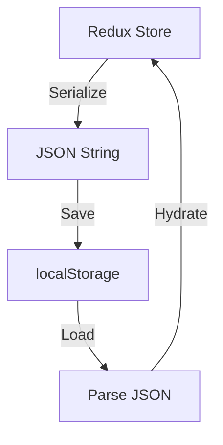
```mermaid
flowchart TD
    A[Redux Store] -->|Serialize| B[JSON String]
    B -->|Save| C[localStorage]
    C -->|Load| D[Parse JSON]
    D -->|Hydrate| A
```

### DEVELOPMENT & DEPLOYMENT

#### Development Tools

| Tool | Purpose | Justification |
|------|---------|---------------|
| Create React App | Project scaffolding | Provides standardized configuration and build system for React applications |
| npm/yarn | Package management | Industry-standard dependency management tools |
| ESLint | Code quality | Enforces consistent code style and helps prevent common errors |
| Prettier | Code formatting | Ensures consistent formatting across the codebase |
| React DevTools | Debugging | Specialized tools for inspecting React component hierarchy and state |
| Redux DevTools | State debugging | Enables time-travel debugging and state inspection for Redux |

#### Build System

| Tool | Purpose | Justification |
|------|---------|---------------|
| webpack | Module bundling | Bundles application code and assets, included with Create React App |
| Babel | JavaScript transpilation | Converts modern JavaScript to browser-compatible code |

#### Deployment Options

| Option | Description | Justification |
|--------|-------------|---------------|
| Static hosting services | GitHub Pages, Netlify, Vercel | Ideal for client-side applications, offering free tiers with CI/CD capabilities |
| Traditional web hosting | Apache, Nginx | Suitable for deployment on existing infrastructure with simple static file serving |

### SYSTEM ARCHITECTURE

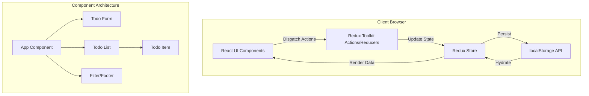
```mermaid
graph TD
    subgraph "Client Browser"
        UI[React UI Components]
        RS[Redux Store]
        RTK[Redux Toolkit Actions/Reducers]
        LS[localStorage API]
        
        UI -->|Dispatch Actions| RTK
        RTK -->|Update State| RS
        RS -->|Render Data| UI
        RS -->|Persist| LS
        LS -->|Hydrate| RS
    end
    
    subgraph "Component Architecture"
        APP[App Component]
        TF[Todo Form]
        TL[Todo List]
        TI[Todo Item]
        FT[Filter/Footer]
        
        APP --> TF
        APP --> TL
        APP --> FT
        TL --> TI
    end
```

### DATA FLOW

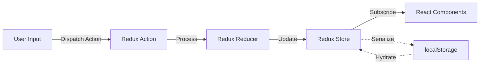
```mermaid
flowchart LR
    A[User Input] -->|Dispatch Action| B[Redux Action]
    B -->|Process| C[Redux Reducer]
    C -->|Update| D[Redux Store]
    D -->|Subscribe| E[React Components]
    D -.->|Serialize| F[localStorage]
    F -.->|Hydrate| D
```

## 4. PROCESS FLOWCHART

### SYSTEM WORKFLOWS

#### Core Business Processes

##### Todo Management Lifecycle

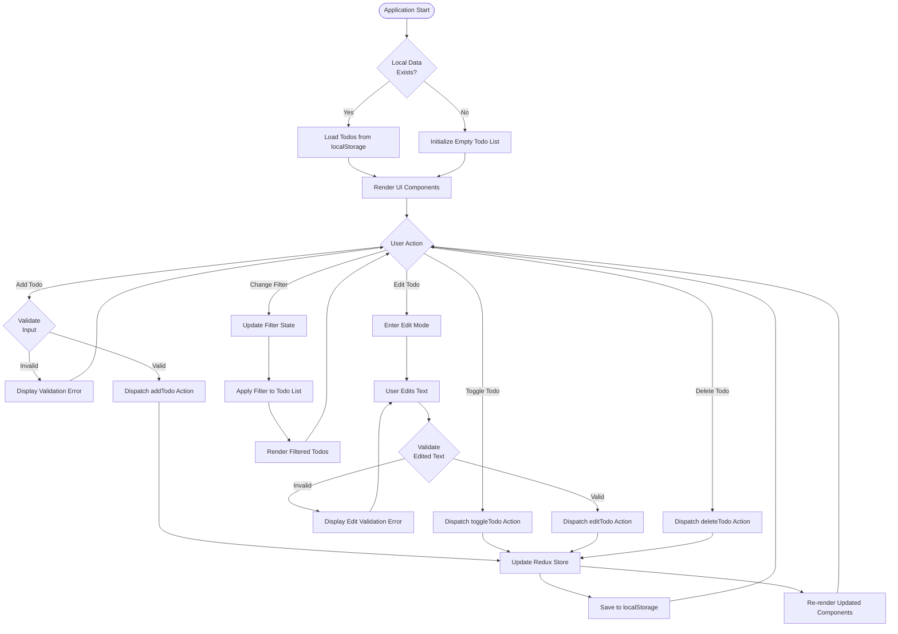
```mermaid
flowchart TD
    Start([Application Start]) --> LoadData{Local Data\nExists?}
    LoadData -->|Yes| HydrateStore[Load Todos from localStorage]
    LoadData -->|No| InitEmpty[Initialize Empty Todo List]
    
    HydrateStore --> RenderUI[Render UI Components]
    InitEmpty --> RenderUI
    
    RenderUI --> UserAction{User Action}
    
    %% Add Todo Path
    UserAction -->|Add Todo| ValidateInput{Validate\nInput}
    ValidateInput -->|Invalid| ShowError[Display Validation Error]
    ShowError --> UserAction
    ValidateInput -->|Valid| AddTodoAction[Dispatch addTodo Action]
    AddTodoAction --> UpdateStore[Update Redux Store]
    
    %% Toggle Todo Path
    UserAction -->|Toggle Todo| ToggleAction[Dispatch toggleTodo Action]
    ToggleAction --> UpdateStore
    
    %% Edit Todo Path
    UserAction -->|Edit Todo| EnterEditMode[Enter Edit Mode]
    EnterEditMode --> EditInput[User Edits Text]
    EditInput --> ValidateEdit{Validate\nEdited Text}
    ValidateEdit -->|Invalid| ShowEditError[Display Edit Validation Error]
    ShowEditError --> EditInput
    ValidateEdit -->|Valid| SaveEdit[Dispatch editTodo Action]
    SaveEdit --> UpdateStore
    
    %% Delete Todo Path
    UserAction -->|Delete Todo| DeleteAction[Dispatch deleteTodo Action]
    DeleteAction --> UpdateStore
    
    %% Filter Todos Path
    UserAction -->|Change Filter| FilterAction[Update Filter State]
    FilterAction --> ApplyFilter[Apply Filter to Todo List]
    ApplyFilter --> RenderFiltered[Render Filtered Todos]
    RenderFiltered --> UserAction
    
    %% Store Update Cycle
    UpdateStore --> PersistData[Save to localStorage]
    UpdateStore --> ReRenderUI[Re-render Updated Components]
    ReRenderUI --> UserAction
    PersistData --> UserAction
```

##### Todo Creation Process

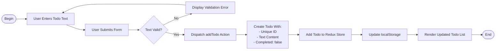
```mermaid
flowchart LR
    Start([Begin]) --> EnterText[User Enters Todo Text]
    EnterText --> Submit[User Submits Form]
    Submit --> Validate{Text Valid?}
    
    Validate -->|No| ErrorDisplay[Display Validation Error]
    ErrorDisplay --> EnterText
    
    Validate -->|Yes| Dispatch[Dispatch addTodo Action]
    Dispatch --> CreateTodo[Create Todo With:
    - Unique ID
    - Text Content
    - Completed: false]
    
    CreateTodo --> AddToStore[Add Todo to Redux Store]
    AddToStore --> PersistStore[Update localStorage]
    PersistStore --> RenderUpdated[Render Updated Todo List]
    RenderUpdated --> End([End])
```

##### Todo Edit Process

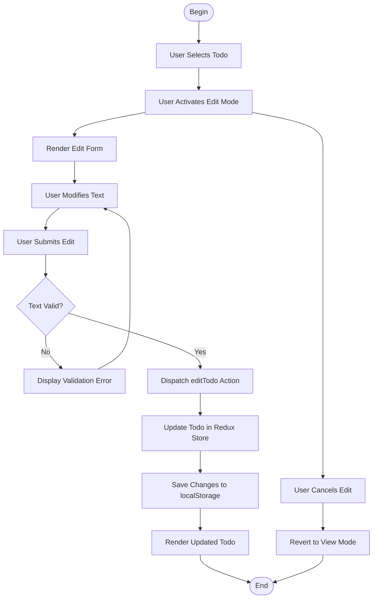
```mermaid
flowchart TD
    Start([Begin]) --> SelectTodo[User Selects Todo]
    SelectTodo --> ClickEdit[User Activates Edit Mode]
    ClickEdit --> RenderEditForm[Render Edit Form]
    RenderEditForm --> ModifyText[User Modifies Text]
    ModifyText --> SubmitEdit[User Submits Edit]
    
    SubmitEdit --> ValidateEdit{Text Valid?}
    ValidateEdit -->|No| ShowError[Display Validation Error]
    ShowError --> ModifyText
    
    ValidateEdit -->|Yes| DispatchEdit[Dispatch editTodo Action]
    DispatchEdit --> UpdateState[Update Todo in Redux Store]
    UpdateState --> PersistChanges[Save Changes to localStorage]
    PersistChanges --> RenderUpdated[Render Updated Todo]
    RenderUpdated --> End([End])
    
    ClickEdit --> CancelEdit[User Cancels Edit]
    CancelEdit --> RevertUI[Revert to View Mode]
    RevertUI --> End
```

#### Integration Workflows

##### Data Persistence Workflow

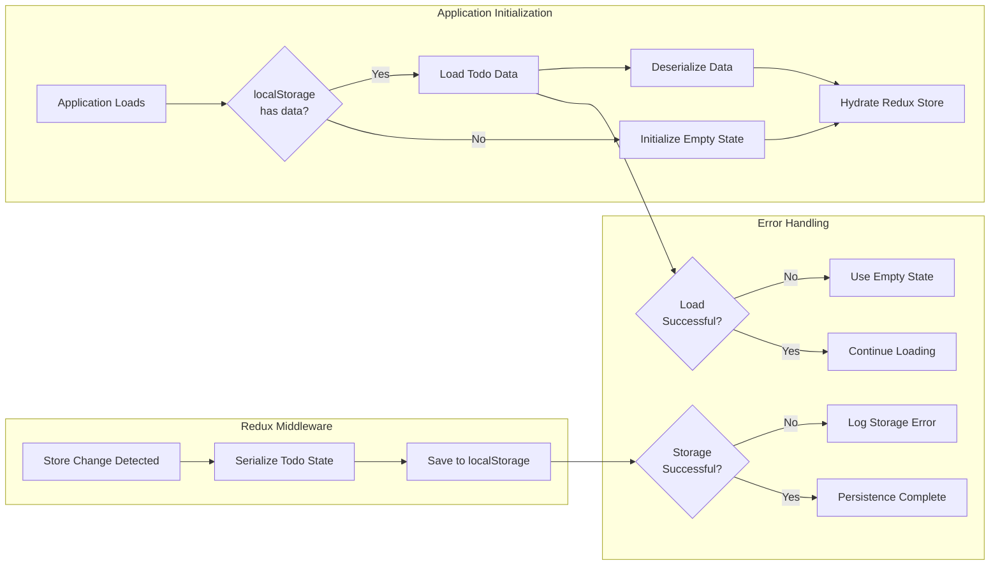
```mermaid
flowchart LR
    subgraph "Redux Middleware"
        StoreChange[Store Change Detected] --> Serialize[Serialize Todo State]
        Serialize --> SaveData[Save to localStorage]
    end
    
    subgraph "Application Initialization"
        AppStart[Application Loads] --> CheckStorage{localStorage\nhas data?}
        CheckStorage -->|Yes| LoadData[Load Todo Data]
        CheckStorage -->|No| InitEmpty[Initialize Empty State]
        LoadData --> Deserialize[Deserialize Data]
        Deserialize --> HydrateStore[Hydrate Redux Store]
        InitEmpty --> HydrateStore
    end
    
    subgraph "Error Handling"
        SaveData --> StorageCheck{Storage\nSuccessful?}
        StorageCheck -->|No| LogError[Log Storage Error]
        StorageCheck -->|Yes| Complete[Persistence Complete]
        
        LoadData --> LoadCheck{Load\nSuccessful?}
        LoadCheck -->|No| FallbackEmpty[Use Empty State]
        LoadCheck -->|Yes| Continue[Continue Loading]
    end
```

### FLOWCHART REQUIREMENTS

#### Todo Filtering Process

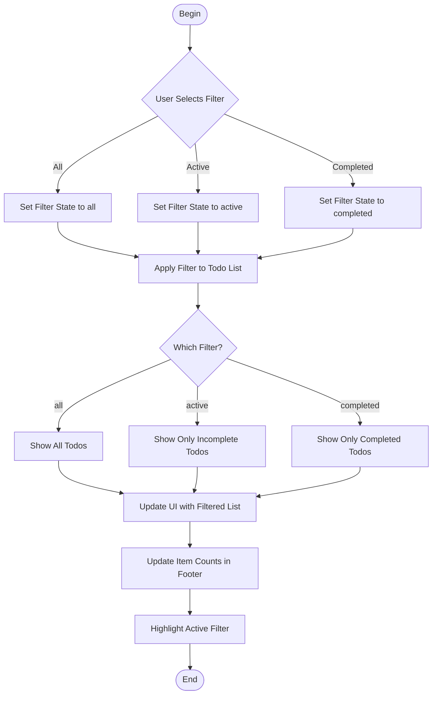
```mermaid
flowchart TD
    Start([Begin]) --> UserFilter{User Selects Filter}
    
    UserFilter -->|All| SetAllFilter[Set Filter State to all]
    UserFilter -->|Active| SetActiveFilter[Set Filter State to active]
    UserFilter -->|Completed| SetCompletedFilter[Set Filter State to completed]
    
    SetAllFilter --> ApplyFilter[Apply Filter to Todo List]
    SetActiveFilter --> ApplyFilter
    SetCompletedFilter --> ApplyFilter
    
    ApplyFilter --> FilterLogic{Which Filter?}
    
    FilterLogic -->|all| ShowAll[Show All Todos]
    FilterLogic -->|active| FilterIncomplete[Show Only Incomplete Todos]
    FilterLogic -->|completed| FilterCompleted[Show Only Completed Todos]
    
    ShowAll --> UpdateUI[Update UI with Filtered List]
    FilterIncomplete --> UpdateUI
    FilterCompleted --> UpdateUI
    
    UpdateUI --> UpdateCounts[Update Item Counts in Footer]
    UpdateCounts --> HighlightFilter[Highlight Active Filter]
    HighlightFilter --> End([End])
```

#### Form Validation Flow

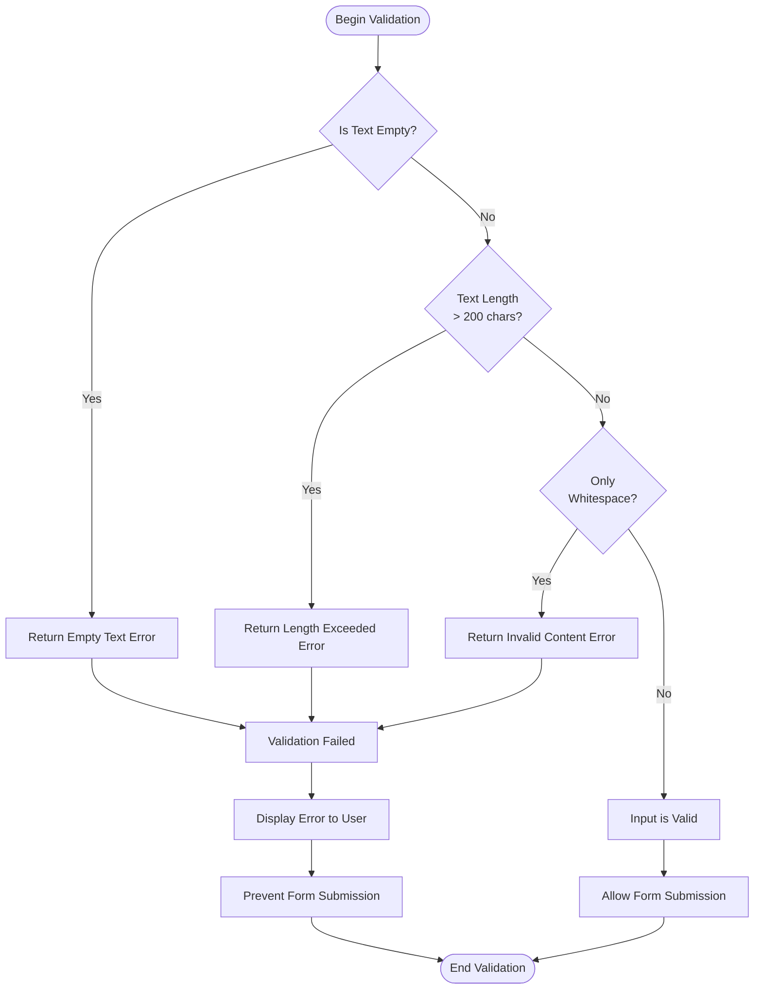
```mermaid
flowchart TD
    Start([Begin Validation]) --> CheckEmpty{Is Text Empty?}
    
    CheckEmpty -->|Yes| EmptyError[Return Empty Text Error]
    EmptyError --> Invalid[Validation Failed]
    
    CheckEmpty -->|No| CheckLength{Text Length\n> 200 chars?}
    
    CheckLength -->|Yes| LengthError[Return Length Exceeded Error]
    LengthError --> Invalid
    
    CheckLength -->|No| CheckWhitespace{Only\nWhitespace?}
    
    CheckWhitespace -->|Yes| WhitespaceError[Return Invalid Content Error]
    WhitespaceError --> Invalid
    
    CheckWhitespace -->|No| ValidInput[Input is Valid]
    
    ValidInput --> AllowSubmit[Allow Form Submission]
    Invalid --> ShowError[Display Error to User]
    ShowError --> PreventSubmit[Prevent Form Submission]
    
    AllowSubmit --> End([End Validation])
    PreventSubmit --> End
```

### TECHNICAL IMPLEMENTATION

#### State Management Flow

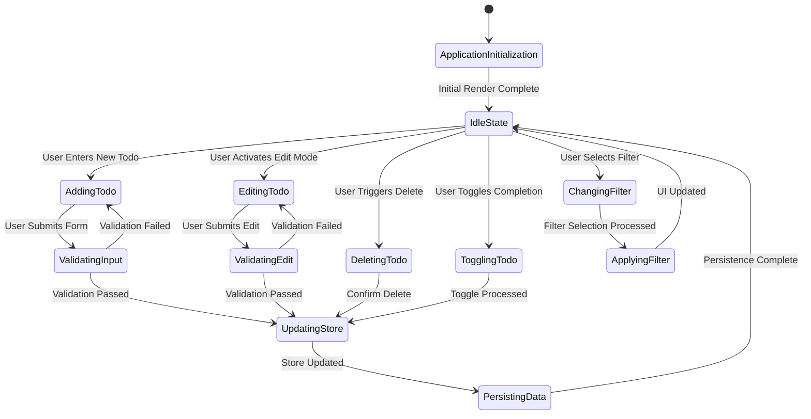
```mermaid
stateDiagram-v2
    [*] --> ApplicationInitialization
    
    ApplicationInitialization --> IdleState: Initial Render Complete
    
    IdleState --> AddingTodo: User Enters New Todo
    AddingTodo --> ValidatingInput: User Submits Form
    ValidatingInput --> AddingTodo: Validation Failed
    ValidatingInput --> UpdatingStore: Validation Passed
    UpdatingStore --> PersistingData: Store Updated
    PersistingData --> IdleState: Persistence Complete
    
    IdleState --> EditingTodo: User Activates Edit Mode
    EditingTodo --> ValidatingEdit: User Submits Edit
    ValidatingEdit --> EditingTodo: Validation Failed
    ValidatingEdit --> UpdatingStore: Validation Passed
    
    IdleState --> DeletingTodo: User Triggers Delete
    DeletingTodo --> UpdatingStore: Confirm Delete
    
    IdleState --> TogglingTodo: User Toggles Completion
    TogglingTodo --> UpdatingStore: Toggle Processed
    
    IdleState --> ChangingFilter: User Selects Filter
    ChangingFilter --> ApplyingFilter: Filter Selection Processed
    ApplyingFilter --> IdleState: UI Updated
```

#### Error Handling Process

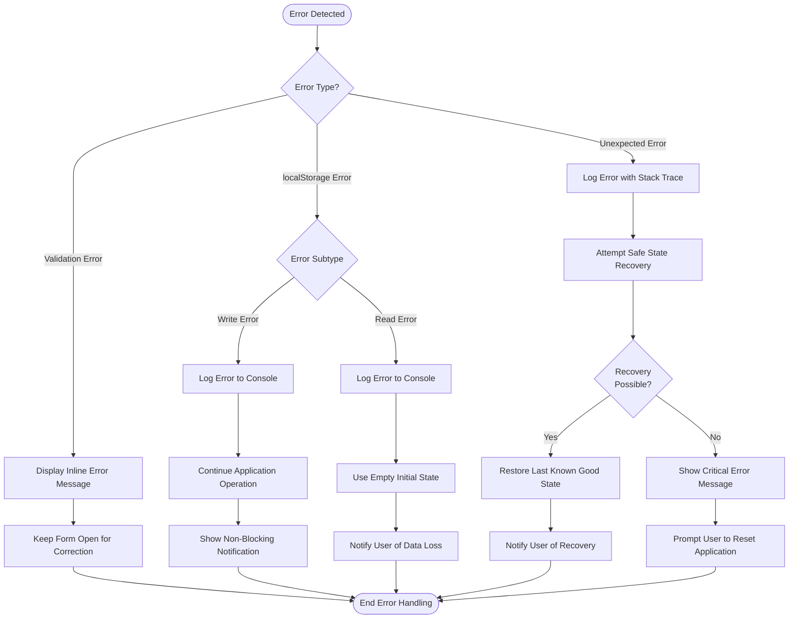
```mermaid
flowchart TD
    Start([Error Detected]) --> ErrorType{Error Type?}
    
    ErrorType -->|Validation Error| HandleValidation[Display Inline Error Message]
    HandleValidation --> AllowRetry[Keep Form Open for Correction]
    AllowRetry --> End([End Error Handling])
    
    ErrorType -->|localStorage Error| StorageErrorType{Error Subtype}
    
    StorageErrorType -->|Write Error| LogWriteError[Log Error to Console]
    LogWriteError --> ContinueOperation[Continue Application Operation]
    ContinueOperation --> NotifyUser[Show Non-Blocking Notification]
    NotifyUser --> End
    
    StorageErrorType -->|Read Error| LogReadError[Log Error to Console]
    LogReadError --> UseFallback[Use Empty Initial State]
    UseFallback --> NotifyDataLoss[Notify User of Data Loss]
    NotifyDataLoss --> End
    
    ErrorType -->|Unexpected Error| LogUnexpected[Log Error with Stack Trace]
    LogUnexpected --> SafeRecovery[Attempt Safe State Recovery]
    SafeRecovery --> RecoveryCheck{Recovery\nPossible?}
    
    RecoveryCheck -->|Yes| RestoreState[Restore Last Known Good State]
    RestoreState --> NotifyRecovery[Notify User of Recovery]
    NotifyRecovery --> End
    
    RecoveryCheck -->|No| NotifyCritical[Show Critical Error Message]
    NotifyCritical --> ResetAction[Prompt User to Reset Application]
    ResetAction --> End
```

### REQUIRED DIAGRAMS

#### High-Level System Workflow

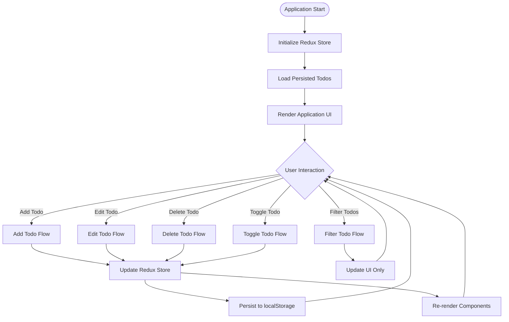
```mermaid
flowchart TD
    Start([Application Start]) --> InitStore[Initialize Redux Store]
    InitStore --> LoadPersisted[Load Persisted Todos]
    LoadPersisted --> RenderApp[Render Application UI]
    
    RenderApp --> UserInteraction{User Interaction}
    
    UserInteraction -->|Add Todo| AddFlow[Add Todo Flow]
    AddFlow --> StoreUpdate[Update Redux Store]
    
    UserInteraction -->|Edit Todo| EditFlow[Edit Todo Flow]
    EditFlow --> StoreUpdate
    
    UserInteraction -->|Delete Todo| DeleteFlow[Delete Todo Flow]
    DeleteFlow --> StoreUpdate
    
    UserInteraction -->|Toggle Todo| ToggleFlow[Toggle Todo Flow]
    ToggleFlow --> StoreUpdate
    
    UserInteraction -->|Filter Todos| FilterFlow[Filter Todo Flow]
    FilterFlow --> UIUpdate[Update UI Only]
    UIUpdate --> UserInteraction
    
    StoreUpdate --> PersistData[Persist to localStorage]
    StoreUpdate --> ReRender[Re-render Components]
    
    PersistData --> UserInteraction
    ReRender --> UserInteraction
```

#### Component Interaction Sequence

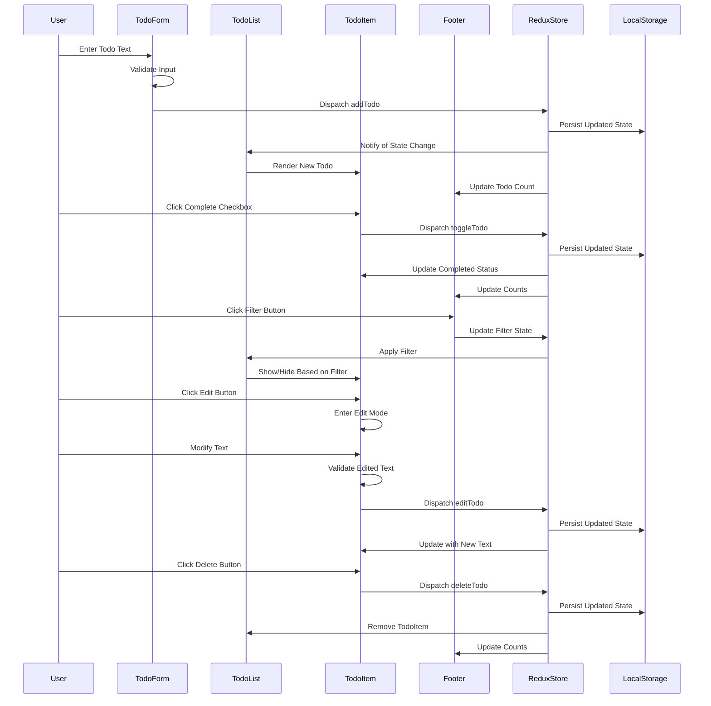
```mermaid
sequenceDiagram
    participant User
    participant TodoForm
    participant TodoList
    participant TodoItem
    participant Footer
    participant ReduxStore
    participant LocalStorage
    
    User->>TodoForm: Enter Todo Text
    TodoForm->>TodoForm: Validate Input
    TodoForm->>ReduxStore: Dispatch addTodo
    ReduxStore->>LocalStorage: Persist Updated State
    ReduxStore->>TodoList: Notify of State Change
    TodoList->>TodoItem: Render New Todo
    ReduxStore->>Footer: Update Todo Count
    
    User->>TodoItem: Click Complete Checkbox
    TodoItem->>ReduxStore: Dispatch toggleTodo
    ReduxStore->>LocalStorage: Persist Updated State
    ReduxStore->>TodoItem: Update Completed Status
    ReduxStore->>Footer: Update Counts
    
    User->>Footer: Click Filter Button
    Footer->>ReduxStore: Update Filter State
    ReduxStore->>TodoList: Apply Filter
    TodoList->>TodoItem: Show/Hide Based on Filter
    
    User->>TodoItem: Click Edit Button
    TodoItem->>TodoItem: Enter Edit Mode
    User->>TodoItem: Modify Text
    TodoItem->>TodoItem: Validate Edited Text
    TodoItem->>ReduxStore: Dispatch editTodo
    ReduxStore->>LocalStorage: Persist Updated State
    ReduxStore->>TodoItem: Update with New Text
    
    User->>TodoItem: Click Delete Button
    TodoItem->>ReduxStore: Dispatch deleteTodo
    ReduxStore->>LocalStorage: Persist Updated State
    ReduxStore->>TodoList: Remove TodoItem
    ReduxStore->>Footer: Update Counts
```

#### Todo Management Swimlane Diagram

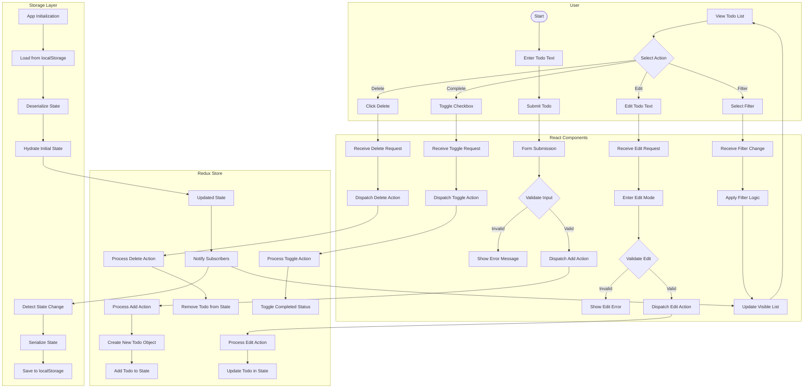
```mermaid
flowchart TD
    subgraph "User"
        U_Start([Start]) --> U_AddTodo[Enter Todo Text]
        U_AddTodo --> U_Submit[Submit Todo]
        U_ViewList[View Todo List] --> U_SelectAction{Select Action}
        U_SelectAction -->|Edit| U_Edit[Edit Todo Text]
        U_SelectAction -->|Delete| U_Delete[Click Delete]
        U_SelectAction -->|Complete| U_Toggle[Toggle Checkbox]
        U_SelectAction -->|Filter| U_Filter[Select Filter]
    end
    
    subgraph "React Components"
        R_FormSubmit[Form Submission] --> R_Validate{Validate Input}
        R_Validate -->|Invalid| R_ShowError[Show Error Message]
        R_Validate -->|Valid| R_DispatchAdd[Dispatch Add Action]
        
        R_ReceiveEdit[Receive Edit Request] --> R_EditMode[Enter Edit Mode]
        R_EditMode --> R_ValidateEdit{Validate Edit}
        R_ValidateEdit -->|Invalid| R_EditError[Show Edit Error]
        R_ValidateEdit -->|Valid| R_DispatchEdit[Dispatch Edit Action]
        
        R_ReceiveDelete[Receive Delete Request] --> R_DispatchDelete[Dispatch Delete Action]
        
        R_ReceiveToggle[Receive Toggle Request] --> R_DispatchToggle[Dispatch Toggle Action]
        
        R_ReceiveFilter[Receive Filter Change] --> R_ApplyFilter[Apply Filter Logic]
        R_ApplyFilter --> R_UpdateList[Update Visible List]
    end
    
    subgraph "Redux Store"
        S_ProcessAdd[Process Add Action] --> S_CreateTodo[Create New Todo Object]
        S_CreateTodo --> S_AddToState[Add Todo to State]
        
        S_ProcessEdit[Process Edit Action] --> S_UpdateTodo[Update Todo in State]
        
        S_ProcessDelete[Process Delete Action] --> S_RemoveTodo[Remove Todo from State]
        
        S_ProcessToggle[Process Toggle Action] --> S_FlipStatus[Toggle Completed Status]
        
        S_UpdateState[Updated State] --> S_NotifySubscribers[Notify Subscribers]
    end
    
    subgraph "Storage Layer"
        P_DetectChange[Detect State Change] --> P_Serialize[Serialize State]
        P_Serialize --> P_SaveStorage[Save to localStorage]
        
        P_AppStart[App Initialization] --> P_LoadStorage[Load from localStorage]
        P_LoadStorage --> P_Deserialize[Deserialize State]
        P_Deserialize --> P_HydrateStore[Hydrate Initial State]
    end
    
    %% Connections between swimlanes
    U_Submit --> R_FormSubmit
    U_Edit --> R_ReceiveEdit
    U_Delete --> R_ReceiveDelete
    U_Toggle --> R_ReceiveToggle
    U_Filter --> R_ReceiveFilter
    
    R_DispatchAdd --> S_ProcessAdd
    R_DispatchEdit --> S_ProcessEdit
    R_DispatchDelete --> S_ProcessDelete
    R_DispatchToggle --> S_ProcessToggle
    
    S_NotifySubscribers --> P_DetectChange
    S_NotifySubscribers --> R_UpdateList
    
    P_HydrateStore --> S_UpdateState
    R_UpdateList --> U_ViewList
```

# 5. SYSTEM ARCHITECTURE

## HIGH-LEVEL ARCHITECTURE

### System Overview

The Todo List application implements a client-side Single Page Application (SPA) architecture following the Flux pattern through Redux. The system employs a unidirectional data flow model where:

- User interactions dispatch actions to the Redux store
- Reducers process these actions to produce a new application state
- React components re-render based on state changes
- localStorage persists the state between sessions

The architecture follows key principles:
- **Component-based design**: Modular UI components with clear responsibilities
- **Single source of truth**: Redux store as the centralized state management
- **Immutable state**: State modifications occur only through action dispatches
- **Unidirectional data flow**: Predictable state changes and UI updates
- **Separation of concerns**: Distinct boundaries between UI, state management, and persistence

The system's boundaries are defined by the browser environment, with all processing happening client-side and persistence limited to browser storage capabilities.

### Core Components Table

| Component Name | Primary Responsibility | Key Dependencies | Critical Considerations |
|----------------|------------------------|------------------|-------------------------|
| App Container | Application entry point and layout structure | React, Redux Store | Proper component composition and routing |
| TodoForm | User input capture for creating todos | Redux actions, Form validation | Input validation, user feedback |
| TodoList | Rendering and managing the collection of todos | TodoItem, Redux store | Efficient rendering for larger lists |
| TodoItem | Individual todo display and interaction | Redux actions | Toggle, edit, and delete interactions |
| Footer | Filter controls and status information | Redux store, Filter actions | Accurate counts, filter state feedback |
| Redux Store | Centralized state management | Redux Toolkit, React-Redux | State normalization, performance |
| Todo Slice | Todo-specific reducers and actions | Redux Toolkit | Proper action design, immutability |
| Filter Slice | Filter state management | Redux Toolkit | Integration with Todo components |
| LocalStorage Service | Data persistence between sessions | Browser localStorage API | Error handling, serialization |

### Data Flow Description

The application implements a unidirectional data flow pattern:

1. **User Interaction Flow**: User actions (adding, editing, completing, or deleting todos) trigger dispatched Redux actions.

2. **State Management Flow**: Redux actions are processed by reducers that produce a new immutable state. The todo slice handles CRUD operations while the filter slice manages view filtering.

3. **Rendering Flow**: React components subscribe to Redux state via selectors and re-render when relevant state changes. The TodoList component renders TodoItems filtered based on the current filter selection.

4. **Persistence Flow**: State changes in the Redux store trigger serialization to localStorage via middleware or effects. On application initialization, the stored state is deserialized and hydrated into the Redux store.

5. **Data Transformation Points**: 
   - Form validation transforms and sanitizes user input before state updates
   - Filtering logic transforms the complete todo list into filtered views
   - Serialization/deserialization transforms state for persistence

6. **Key Data Stores**:
   - Redux store as the in-memory application state
   - localStorage as the persistence mechanism

## COMPONENT DETAILS

### React UI Components

#### App Component
- **Purpose**: Serves as the application container, providing layout structure
- **Technologies**: React functional component with hooks
- **Key Interfaces**: Renders TodoForm, TodoList, and Footer components
- **Data Requirements**: None (container only)

#### TodoForm Component
- **Purpose**: Captures user input for creating new todos
- **Technologies**: React functional component, form elements
- **Key Interfaces**: 
  - Props: `onSubmit` for handling form submission
  - Local state for form input management
- **Data Requirements**: Temporary form state

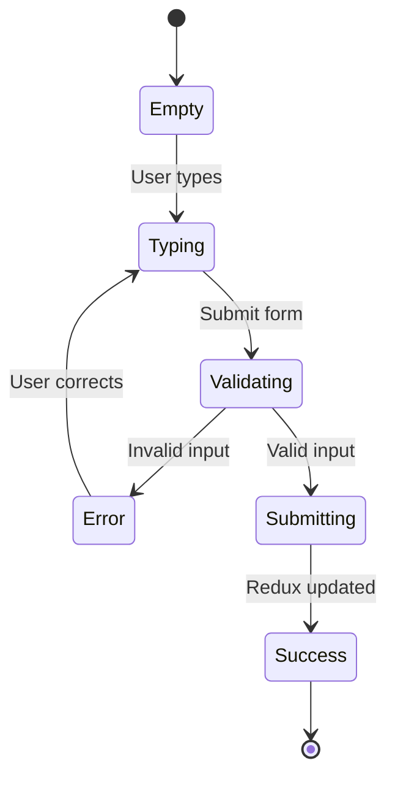
```mermaid
stateDiagram-v2
    [*] --> Empty
    Empty --> Typing: User types
    Typing --> Validating: Submit form
    Validating --> Error: Invalid input
    Validating --> Submitting: Valid input
    Error --> Typing: User corrects
    Submitting --> Success: Redux updated
    Success --> [*]
```

#### TodoList Component
- **Purpose**: Renders and manages the filtered list of todo items
- **Technologies**: React functional component with Redux integration
- **Key Interfaces**:
  - Redux selectors for filtered todos
  - Renders TodoItem components
- **Data Requirements**: Read-only access to Redux todo state and filter state

#### TodoItem Component
- **Purpose**: Displays and enables interaction with individual todo items
- **Technologies**: React functional component with Redux actions
- **Key Interfaces**:
  - Props: `todo` object with id, text, completed status
  - Redux actions: toggleTodo, editTodo, deleteTodo
- **Data Requirements**: Todo item data, edit state

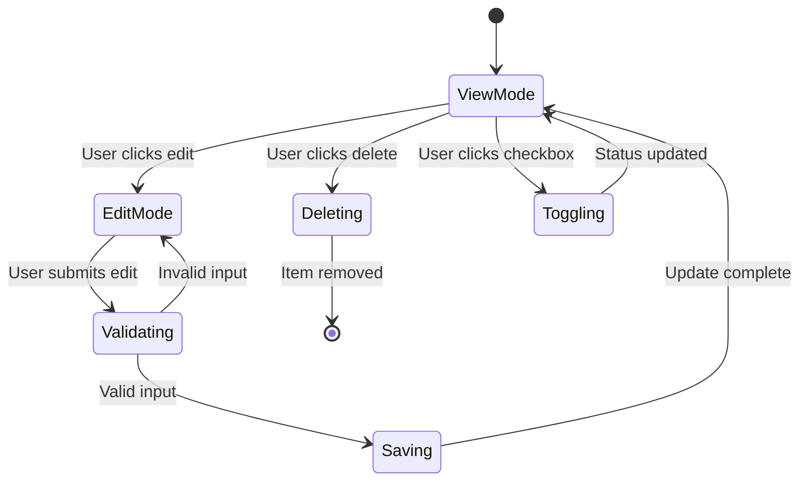
```mermaid
stateDiagram-v2
    [*] --> ViewMode
    ViewMode --> EditMode: User clicks edit
    EditMode --> Validating: User submits edit
    Validating --> EditMode: Invalid input
    Validating --> Saving: Valid input
    Saving --> ViewMode: Update complete
    ViewMode --> Deleting: User clicks delete
    Deleting --> [*]: Item removed
    ViewMode --> Toggling: User clicks checkbox
    Toggling --> ViewMode: Status updated
```

#### Footer Component
- **Purpose**: Provides filtering controls and displays todo counts
- **Technologies**: React functional component with Redux integration
- **Key Interfaces**:
  - Redux selectors for todo counts
  - Redux actions for changing filters
- **Data Requirements**: Filter state, aggregate todo counts

### Redux Store Structure

#### Store Configuration
- **Purpose**: Centralizes application state and configuration
- **Technologies**: Redux Toolkit configureStore
- **Key Interfaces**: Store object, dispatch function
- **Data Requirements**: Initial state hydration from localStorage

#### Todo Slice
- **Purpose**: Manages todo item state and operations
- **Technologies**: Redux Toolkit createSlice
- **Key Interfaces**: 
  - Reducers: addTodo, toggleTodo, editTodo, deleteTodo
  - Selectors: getTodos, getFilteredTodos
- **Data Requirements**: Array of todo objects with id, text, completed fields

#### Filter Slice
- **Purpose**: Manages active filter selection
- **Technologies**: Redux Toolkit createSlice
- **Key Interfaces**:
  - Reducers: setFilter
  - Selectors: getActiveFilter
- **Data Requirements**: Current filter value (string)

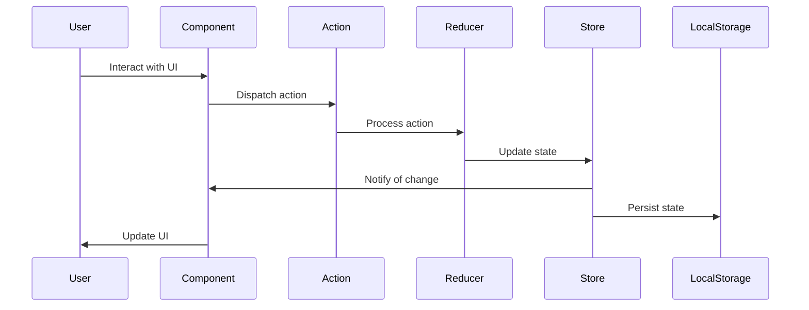
```mermaid
sequenceDiagram
    participant User
    participant Component
    participant Action
    participant Reducer
    participant Store
    participant LocalStorage
    
    User->>Component: Interact with UI
    Component->>Action: Dispatch action
    Action->>Reducer: Process action
    Reducer->>Store: Update state
    Store->>Component: Notify of change
    Store->>LocalStorage: Persist state
    Component->>User: Update UI
```

### Persistence Layer

#### LocalStorage Service
- **Purpose**: Persists application state between browser sessions
- **Technologies**: Browser localStorage API, JSON serialization
- **Key Interfaces**:
  - saveState(state): Serializes and stores state
  - loadState(): Retrieves and deserializes state
- **Data Requirements**: JSON-serializable state object

## TECHNICAL DECISIONS

### Architecture Style Decisions

| Decision | Options | Selection | Rationale |
|----------|---------|-----------|-----------|
| State Management | Context API, MobX, Redux | Redux with Redux Toolkit | Better for complex state with many operations; DevTools support; predictable state transitions |
| Component Model | Class components, Functional components | Functional components with hooks | Modern approach; better performance; simpler code; easier testing |
| Component Organization | Feature-based, Type-based | Feature-based structure | Improves maintainability; better encapsulation; enables easier feature extension |
| Styling Approach | CSS Modules, Styled Components, Plain CSS | CSS for simplicity | Appropriate for scale; no additional dependencies; familiar for developers |

### Data Management Decisions

| Decision | Options | Selection | Rationale |
|----------|---------|-----------|-----------|
| Persistence Strategy | localStorage, sessionStorage, IndexedDB | localStorage | Simple API; sufficient for todo data; widely supported |
| State Structure | Normalized, Nested | Simple array for todos | Appropriate for data complexity; easier filtering; simpler reducers |
| Action Design | Object-based, Creator functions | Action creators with Redux Toolkit | Reduced boilerplate; type safety; consistent pattern |
| Filtering Implementation | Component-level, Redux state | Redux filter state | Consistent approach; enables URL sync in future; persistent filter selection |

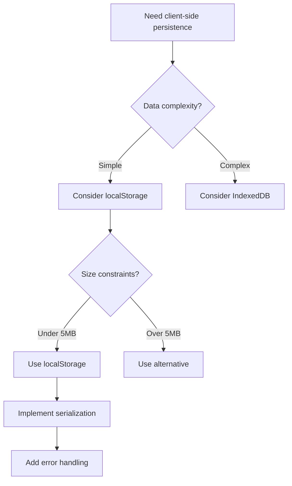
```mermaid
graph TD
    A[Need client-side persistence] --> B{Data complexity?}
    B -->|Simple| C[Consider localStorage]
    B -->|Complex| D[Consider IndexedDB]
    C --> E{Size constraints?}
    E -->|Under 5MB| F[Use localStorage]
    E -->|Over 5MB| G[Use alternative]
    F --> H[Implement serialization]
    H --> I[Add error handling]
```

## CROSS-CUTTING CONCERNS

### Error Handling Patterns

The application implements structured error handling for:

- **Form Validation Errors**: Client-side validation with immediate feedback
- **localStorage Errors**: Graceful degradation when storage is unavailable
- **Redux State Integrity**: Validation middleware to ensure state consistency

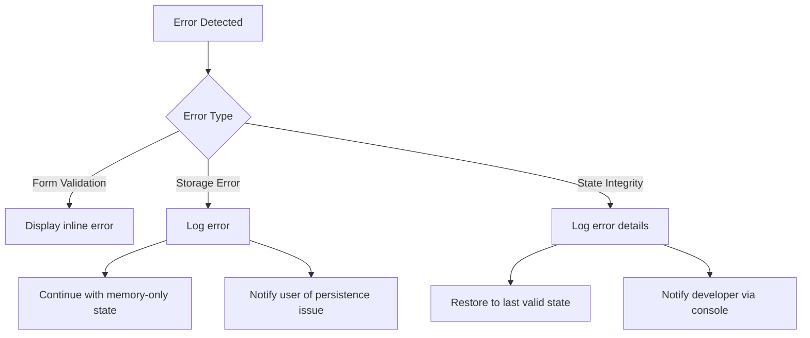
```mermaid
flowchart TD
    A[Error Detected] --> B{Error Type}
    B -->|Form Validation| C[Display inline error]
    B -->|Storage Error| D[Log error]
    D --> E[Continue with memory-only state]
    D --> F[Notify user of persistence issue]
    B -->|State Integrity| G[Log error details]
    G --> H[Restore to last valid state]
    G --> I[Notify developer via console]
```

### Performance Considerations

| Concern | Approach | Implementation |
|---------|----------|----------------|
| Large Todo Lists | List virtualization | Consider React-Window for large lists |
| Redux Performance | Memoized selectors | Use createSelector for filtered lists |
| Re-render Prevention | Component memoization | React.memo for pure components |
| Storage Limitations | Data pruning | Implement cleanup for very old completed todos |

### Browser Compatibility

The application targets modern browsers with:

- ES6+ JavaScript features (with appropriate polyfills if needed)
- Modern CSS capabilities (flexbox, grid)
- localStorage API support

Fallback strategies include:
- Feature detection for storage APIs
- Graceful degradation for older browsers
- Clear error messages when requirements aren't met

## 6. SYSTEM COMPONENTS DESIGN

### 6.1 REDUX COMPONENTS

#### 6.1.1 Store Configuration

**Component Description:**
The Redux store serves as the application's single source of truth, managing the entire state tree and coordinating state updates across all components.

**Technical Specifications:**
```javascript
// store.js
import { configureStore } from '@reduxjs/toolkit';
import todosReducer from './features/todos/todosSlice';
import filtersReducer from './features/filters/filtersSlice';
```

**State Structure:**
```javascript
{
  todos: {
    entities: [
      { id: string, text: string, completed: boolean }
    ]
  },
  filters: {
    status: string // 'all' | 'active' | 'completed'
  }
}
```

**Storage Interface:**
- Middleware will intercept actions to persist state changes to localStorage
- On initialization, the store will hydrate its state from localStorage if available

**Performance Optimizations:**
- Serialization will be applied only to required state portions
- State updates will be batched where possible to prevent redundant localStorage writes

#### 6.1.2 Todo Slice

**Component Description:**
The Todo slice manages the collection of todo items and provides actions for creating, updating, deleting, and toggling todo completion status.

**Action Creators:**
| Action | Parameters | Return Type | Description |
|--------|------------|-------------|-------------|
| addTodo | text: string | { type: string, payload: { id: string, text: string, completed: boolean } } | Creates a new todo with the specified text |
| toggleTodo | id: string | { type: string, payload: id } | Toggles the completed status of a todo |
| deleteTodo | id: string | { type: string, payload: id } | Removes a todo from the collection |
| editTodo | id: string, text: string | { type: string, payload: { id, text } } | Updates the text of an existing todo |

**Reducers:**
```javascript
// Conceptual reducer logic
const todosReducer = {
  addTodo: (state, action) => {
    // Add new todo to state.entities array
  },
  toggleTodo: (state, action) => {
    // Find todo by id and toggle completed status
  },
  deleteTodo: (state, action) => {
    // Remove todo with matching id from state.entities
  },
  editTodo: (state, action) => {
    // Find todo by id and update its text
  }
};
```

**Selectors:**
| Selector | Parameters | Return Type | Description |
|----------|------------|-------------|-------------|
| selectAllTodos | state | Array<Todo> | Returns the complete list of todos |
| selectFilteredTodos | state | Array<Todo> | Returns todos filtered by the current status filter |
| selectActiveTodoCount | state | number | Returns the count of incomplete todos |
| selectCompletedTodoCount | state | number | Returns the count of completed todos |

#### 6.1.3 Filter Slice

**Component Description:**
The Filter slice manages the current filter selection state, determining which todos are displayed in the UI.

**State Structure:**
```javascript
{
  status: 'all' // One of: 'all', 'active', 'completed'
}
```

**Action Creators:**
| Action | Parameters | Return Type | Description |
|--------|------------|-------------|-------------|
| setFilter | filter: string | { type: string, payload: string } | Updates the current filter selection |

**Reducers:**
```javascript
// Conceptual reducer logic
const filtersReducer = {
  setFilter: (state, action) => {
    state.status = action.payload;
  }
};
```

**Selectors:**
| Selector | Parameters | Return Type | Description |
|----------|------------|-------------|-------------|
| selectCurrentFilter | state | string | Returns the currently active filter value |

### 6.2 REACT COMPONENTS

#### 6.2.1 App Component

**Component Description:**
The App component serves as the root container for the application, orchestrating the layout and component hierarchy.

**Component Structure:**
```jsx
// Simplified structure
<div className="todoapp">
  <header className="header">
    <h1>todos</h1>
    <TodoForm />
  </header>
  <section className="main">
    <TodoList />
  </section>
  <Footer />
</div>
```

**Responsibilities:**
- Application initialization (including hydrating store from localStorage)
- Main layout structure
- Component composition

**Props:** None (Root component)

#### 6.2.2 TodoForm Component

**Component Description:**
The TodoForm component provides the user interface for creating new todo items.

**Component Structure:**
```jsx
// Simplified structure
<form onSubmit={handleSubmit}>
  <input
    className="new-todo"
    placeholder="What needs to be done?"
    value={text}
    onChange={handleChange}
  />
</form>
```

**State Management:**
| State | Type | Purpose |
|-------|------|---------|
| text | string | Stores the current input text value |
| isValid | boolean | Tracks whether the current input passes validation |
| error | string | Contains validation error message when applicable |

**Event Handlers:**
| Handler | Triggered By | Action |
|---------|--------------|--------|
| handleChange | Input change | Updates the text state and validates input |
| handleSubmit | Form submission | Dispatches addTodo action and clears form |

**Validation Rules:**
- Input must not be empty
- Input must not exceed 200 characters
- Input must not consist of only whitespace

#### 6.2.3 TodoList Component

**Component Description:**
The TodoList component renders the filtered collection of todo items and handles their display logic.

**Component Structure:**
```jsx
// Simplified structure
<ul className="todo-list">
  {filteredTodos.map(todo => (
    <TodoItem key={todo.id} todo={todo} />
  ))}
</ul>
```

**Redux Integration:**
- Subscribes to the filtered todos from the Redux store
- Re-renders when the todo collection or active filter changes

**Optimizations:**
- Implements React.memo to prevent unnecessary re-renders
- Uses key prop for efficient list reconciliation

#### 6.2.4 TodoItem Component

**Component Description:**
The TodoItem component displays an individual todo item and provides controls for completion toggling, editing, and deletion.

**Component States:**
| State | Description |
|-------|-------------|
| View Mode | Normal display of todo item with completion toggle and action buttons |
| Edit Mode | Displays an editable input field for modifying todo text |

**Component Structure:**
```jsx
// Simplified structure - View Mode
<li className={classNames({ completed: todo.completed })}>
  <div className="view">
    <input 
      type="checkbox" 
      className="toggle"
      checked={todo.completed}
      onChange={() => onToggle(todo.id)}
    />
    <label onDoubleClick={activateEditMode}>{todo.text}</label>
    <button className="destroy" onClick={() => onDelete(todo.id)} />
  </div>
</li>

// Simplified structure - Edit Mode
<li className="editing">
  <input
    className="edit"
    value={editText}
    onChange={handleEditChange}
    onBlur={handleSubmit}
    onKeyDown={handleKeyDown}
  />
</li>
```

**Props Interface:**
```typescript
interface TodoItemProps {
  todo: {
    id: string;
    text: string;
    completed: boolean;
  };
}
```

**Event Handlers:**
| Handler | Purpose |
|---------|---------|
| handleToggle | Dispatches toggleTodo action |
| handleDelete | Dispatches deleteTodo action |
| activateEditMode | Switches to edit mode and focuses input |
| handleEditChange | Updates local edit text state |
| handleSubmit | Validates and dispatches editTodo action |
| handleKeyDown | Handles escape (cancel) and enter (submit) keys |

#### 6.2.5 Footer Component

**Component Description:**
The Footer component displays summary information about todo items and provides controls for filtering the todo list view.

**Component Structure:**
```jsx
// Simplified structure
<footer className="footer">
  <span className="todo-count">
    <strong>{activeTodoCount}</strong> {activeTodoCount === 1 ? 'item' : 'items'} left
  </span>
  <ul className="filters">
    <li>
      <a className={currentFilter === 'all' ? 'selected' : ''} onClick={() => onFilterChange('all')}>All</a>
    </li>
    <li>
      <a className={currentFilter === 'active' ? 'selected' : ''} onClick={() => onFilterChange('active')}>Active</a>
    </li>
    <li>
      <a className={currentFilter === 'completed' ? 'selected' : ''} onClick={() => onFilterChange('completed')}>Completed</a>
    </li>
  </ul>
</footer>
```

**Redux Integration:**
- Retrieves active todo count from the Redux store
- Retrieves current filter from the Redux store
- Dispatches setFilter action when filter options are clicked

**Conditional Rendering:**
- Footer is only displayed when there are todos in the list
- Clear completed button only appears when completed todos exist

### 6.3 UTILITY COMPONENTS

#### 6.3.1 LocalStorage Service

**Component Description:**
The LocalStorage service provides a standardized interface for persisting and retrieving application state from browser storage.

**Interface:**
```typescript
interface LocalStorageService {
  saveState(state: object): void;
  loadState(): object | undefined;
}
```

**Key Functions:**
| Function | Purpose | Error Handling |
|----------|---------|----------------|
| saveState | Serializes and stores Redux state | Catches and logs JSON/storage errors |
| loadState | Retrieves and deserializes stored state | Returns undefined on error or missing data |

**Implementation Considerations:**
- Implements throttling to prevent excessive writes during rapid state changes
- Includes error boundary to prevent application crashes on storage failures
- Uses versioning pattern to handle data structure changes

#### 6.3.2 Validation Utilities

**Component Description:**
Validation utilities provide reusable functions for validating user input across the application.

**Interface:**
```typescript
interface ValidationResult {
  isValid: boolean;
  errorMessage?: string;
}

interface ValidationUtilities {
  validateTodoText(text: string): ValidationResult;
}
```

**Validation Rules:**
| Rule | Error Message |
|------|---------------|
| Text is not empty | "Todo text cannot be empty" |
| Text length <= 200 characters | "Todo text cannot exceed 200 characters" |
| Text is not only whitespace | "Todo text cannot be only whitespace" |

### 6.4 COMPONENT RELATIONSHIPS

#### 6.4.1 Component Interaction Diagram

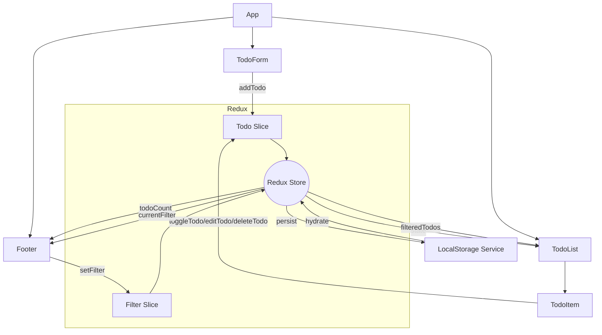
```mermaid
graph TD
    App --> TodoForm
    App --> TodoList
    App --> Footer
    TodoList --> TodoItem
    
    subgraph Redux
        Store((Redux Store))
        TodoSlice[Todo Slice]
        FilterSlice[Filter Slice]
    end
    
    TodoForm -- addTodo --> TodoSlice
    TodoItem -- toggleTodo/editTodo/deleteTodo --> TodoSlice
    Footer -- setFilter --> FilterSlice
    
    TodoSlice --> Store
    FilterSlice --> Store
    
    Store -- state --> TodoList
    Store -- filteredTodos --> TodoList
    Store -- todoCount --> Footer
    Store -- currentFilter --> Footer
    
    LocalStorage[LocalStorage Service]
    Store -- persist --> LocalStorage
    LocalStorage -- hydrate --> Store
```

#### 6.4.2 Data Flow

```mermaid
sequenceDiagram
    participant User
    participant UI as UI Components
    participant Actions as Action Creators
    participant Store as Redux Store
    participant Storage as LocalStorage
    
    User->>UI: Interact (add/edit/delete/toggle)
    UI->>Actions: Dispatch action
    Actions->>Store: Process action
    Store->>Store: Update state
    Store->>Storage: Persist changes
    Store->>UI: Notify of state change
    UI->>User: Update display
```

### 6.5 RESPONSIVENESS AND STYLING

#### 6.5.1 Responsive Design Breakpoints

| Breakpoint | Range | Optimization |
|------------|-------|--------------|
| Mobile | < 480px | Single column layout, larger touch targets |
| Tablet | 481px - 768px | Optimized spacing, medium input sizes |
| Desktop | > 768px | Full layout with optimized spacing |

#### 6.5.2 CSS Structure

The application will use a modular CSS approach with the following structure:

```
styles/
  ├── base.css        # Reset and base styles
  ├── components/     # Component-specific styles
  │   ├── TodoForm.css
  │   ├── TodoItem.css
  │   ├── TodoList.css
  │   └── Footer.css
  ├── layout.css      # Layout and structure
  └── utilities.css   # Utility classes
```

**Key UI Considerations:**
- Accessible color contrast ratios (WCAG AA compliance)
- Clear visual indicators for interactive elements
- Consistent spacing and typography
- Smooth transitions for state changes
- Touch-friendly sizing on mobile devices

### 6.6 ERROR HANDLING AND EDGE CASES

#### 6.6.1 Form Validation Errors

| Error Case | Handling Strategy |
|------------|-------------------|
| Empty todo text | Prevent submission, show inline error |
| Excessive length | Truncate or prevent submission with message |
| Whitespace only | Treat as invalid, display appropriate message |

#### 6.6.2 LocalStorage Failures

| Failure Mode | Handling Strategy |
|--------------|-------------------|
| Storage unavailable | Proceed with in-memory state only, show notification |
| Quota exceeded | Remove oldest completed todos, notify user |
| Corrupted data | Reset to default state, log error details |

#### 6.6.3 User Experience Edge Cases

| Edge Case | Handling Strategy |
|-----------|-------------------|
| Very large todo lists | Implement virtualized list rendering |
| No todos exist | Show appropriate empty state message |
| All todos filtered out | Show message indicating no todos match filter |
| Mid-edit page refresh | Auto-save draft edits to prevent data loss |

### 6.1 CORE SERVICES ARCHITECTURE

Core Services Architecture in its traditional definition (microservices, service boundaries, inter-service communication) is not applicable for this system. This Todo List application implements a client-side monolithic architecture with the following characteristics:

#### CLIENT-SIDE ARCHITECTURE COMPONENTS

| Component Type | Description | Responsibility |
|----------------|-------------|----------------|
| UI Layer | React Components | Render interface elements and handle user interactions |
| State Management | Redux Store | Maintain centralized application state and handle state transitions |
| Business Logic | Redux Slice Reducers | Process actions and implement business rules for todo management |
| Data Persistence | LocalStorage Adapter | Provide data persistence between browser sessions |

#### STATE MANAGEMENT FLOW

```mermaid
flowchart TD
    A[User Interaction] -->|Triggers| B[Action Creator]
    B -->|Dispatches| C[Action]
    C -->|Processed by| D[Reducer]
    D -->|Updates| E[Redux Store]
    E -->|Notifies| F[React Components]
    F -->|Re-render| G[UI Update]
    E -.->|Persists to| H[LocalStorage]
    H -.->|Hydrates| E
```

#### CLIENT-SIDE RESILIENCE CONSIDERATIONS

| Challenge | Approach | Implementation |
|-----------|----------|----------------|
| Browser Crashes | State Persistence | Frequent localStorage synchronization |
| Network Disconnection | Offline Support | No network dependency for core functionality |
| localStorage Failures | Graceful Degradation | Fallback to in-memory operation with user notification |
| Data Corruption | Validation | Schema validation before state hydration |

#### SCALING CONSIDERATIONS

While traditional scaling approaches don't apply to this client-side application, the following optimizations address performance as the todo list grows:

```mermaid
flowchart LR
    subgraph "Performance Optimizations"
        A[React.memo] -->|Prevents unnecessary renders| B[Component Efficiency]
        C[Selector Memoization] -->|Optimizes state derivation| D[State Access Efficiency]
        E[Virtualized Lists] -->|Renders only visible items| F[DOM Efficiency]
        G[Storage Throttling] -->|Prevents excessive writes| H[Storage Efficiency]
    end
```

#### CLIENT-SIDE STORAGE MANAGEMENT

The application implements client-side storage management with the following considerations:

| Aspect | Implementation | Benefit |
|--------|----------------|---------|
| State Serialization | JSON serialization with validation | Ensures data integrity |
| Change Detection | Middleware-based tracking | Minimizes storage operations |
| Storage Limits | Item count monitoring | Prevents exceeding browser quotas |
| Data Recovery | Backup/restore capabilities | Protects against corruption |

Since this is a client-side application, traditional service-oriented architecture concepts like service discovery, load balancing, and circuit breaker patterns do not apply. Instead, the application focuses on efficient state management, optimized rendering, and robust client-side data persistence to provide a responsive and reliable user experience.

## 6.2 DATABASE DESIGN

Database Design in the traditional sense (relational or NoSQL databases, server-side storage) is not applicable to this system. Instead, this Todo List application implements client-side persistence using the browser's localStorage API.

### CLIENT-SIDE STORAGE ARCHITECTURE

#### Data Persistence Model

```mermaid
graph TD
    A[Redux Store] -->|Serialize| B[JSON String]
    B -->|Write| C[localStorage]
    C -->|Read| D[Parsed JSON]
    D -->|Hydrate| A
```

#### Data Structure

| Storage Key | Value Type | Description | Purpose |
|-------------|------------|-------------|---------|
| `todoApp.todos` | JSON String | Serialized todos array | Persists the todo items collection |
| `todoApp.filters` | JSON String | Serialized filter state | Persists the active filter selection |

**Todo Item Structure:**
```javascript
{
  id: string,       // Unique identifier (generated with nanoid)
  text: string,     // Todo content text
  completed: boolean // Completion status flag
}
```

### DATA MANAGEMENT STRATEGY

#### Storage and Retrieval Mechanism

```mermaid
flowchart LR
    subgraph "Write Operation"
        A[Action Dispatched] --> B[State Updated]
        B --> C[Storage Middleware]
        C --> D["localStorage.setItem()"]
    end
    
    subgraph "Read Operation"
        E[Application Start] --> F["localStorage.getItem()"]
        F --> G[Parse JSON]
        G --> H[Validate Schema]
        H --> I[Hydrate Store]
    end
```

| Operation | Implementation Approach | Error Handling |
|-----------|--------------------------|----------------|
| Write | Middleware intercepts state changes | Try/catch with fallback to memory-only state |
| Read | On app initialization | JSON parse error handling with default state fallback |
| Synchronization | On Redux state updates | Throttled to prevent excessive writes |

#### Version Management

| Concern | Strategy | Implementation |
|---------|----------|----------------|
| Schema Changes | Version key | Include version metadata in stored JSON |
| Migration | Migration utility | Transform data structure on version mismatch |
| Compatibility | Defensive parsing | Handle missing fields with defaults |

### STORAGE LIMITATIONS AND OPTIMIZATIONS

#### Constraints Management

```mermaid
flowchart TD
    A[Storage Operation] --> B{Size > 5MB?}
    B -->|Yes| C[Implement Clean-up]
    C --> D[Remove Oldest Completed]
    D --> E[Retry Storage]
    B -->|No| F[Storage Succeeds]
    
    G[Storage Error] --> H{Type?}
    H -->|Quota| I[Notify User]
    I --> J[Suggest Clean-up]
    H -->|Other| K[Fallback to Memory]
    K --> L[Show Warning]
```

| Limitation | Mitigation Strategy | Implementation |
|------------|---------------------|----------------|
| 5-10MB Limit | Todo count limiting | Alert user when approaching limits |
| No query capability | Indexed in-memory filtering | Implement selectors for efficient filtering |
| No relationships | Flat data structure | Keep data model simple and denormalized |
| No transactions | Atomic updates | Complete state updates in single operations |

#### Performance Considerations

| Optimization | Purpose | Implementation |
|--------------|---------|----------------|
| Throttling | Reduce write frequency | Debounce storage updates (300-500ms) |
| Partial updates | Minimize transfer size | Store only changed state portions when possible |
| Serialization efficiency | Reduce overhead | Use efficient JSON serialization |
| Selective persistence | Reduce storage size | Only persist essential state (exclude UI state) |

### COMPLIANCE AND RECOVERY

#### Data Integrity

| Concern | Approach | Implementation |
|---------|----------|----------------|
| Corruption prevention | Validation | Schema validation before hydration |
| Recovery options | Backup mechanism | Optional export/import functionality |
| Data loss prevention | Error boundary | Capture and log storage errors |

#### Privacy Considerations

| Consideration | Approach | Implementation |
|---------------|----------|----------------|
| Data isolation | Origin-bound storage | Leverages browser's same-origin policy |
| No sensitive data | Data classification | Store only task text and status |
| User control | Clear data option | Provide UI option to reset all data |

### ALTERNATIVE CONSIDERATIONS

For applications requiring more robust client-side storage, the following alternatives could be considered:

| Alternative | Advantages | Limitations |
|-------------|------------|------------|
| IndexedDB | Larger storage limits, indexing | More complex API, overkill for this use case |
| WebSQL | SQL query capabilities | Deprecated standard, limited browser support |
| Firebase | Real-time sync, multi-device | Requires backend, authentication complexity |

The localStorage approach was selected for this Todo List application due to its simplicity, broad browser support, and sufficient capabilities for the current requirements. The implementation includes appropriate error handling and optimizations to provide a reliable user experience within the constraints of client-side storage.

## 6.3 INTEGRATION ARCHITECTURE

Integration Architecture in its traditional definition is not applicable for this system. This Todo List application is a self-contained client-side application that does not directly integrate with external systems, APIs, or services. All functionality is implemented within the browser using React, Redux, and localStorage.

### CLIENT-SIDE INTEGRATION PATTERNS

While external integration is not required, the application does implement several internal integration patterns:

#### Component-to-Store Integration

```mermaid
flowchart LR
    subgraph "React Components"
        A[TodoForm]
        B[TodoItem]
        C[TodoList]
        D[Footer]
    end
    
    subgraph "Redux Store"
        E[Todo Slice]
        F[Filter Slice]
    end
    
    A -->|addTodo| E
    B -->|toggleTodo| E
    B -->|editTodo| E
    B -->|deleteTodo| E
    D -->|setFilter| F
    
    E -->|state changes| C
    E -->|counts| D
    F -->|filter state| C
    F -->|active filter| D
```

#### Store-to-Persistence Integration

```mermaid
sequenceDiagram
    participant Components as React Components
    participant Store as Redux Store
    participant Middleware as Storage Middleware
    participant LocalStorage as Browser localStorage
    
    Components->>Store: Dispatch Action
    Store->>Store: Update State
    Store->>Middleware: State Changed
    Middleware->>Middleware: Serialize State
    Middleware->>LocalStorage: Write to localStorage
    
    Note over LocalStorage: Persistent Storage
    
    LocalStorage-->>Middleware: Read on App Start
    Middleware-->>Middleware: Deserialize State
    Middleware-->>Store: Hydrate Store
    Store-->>Components: Render with Stored State
```

### DATA CONTRACT SPECIFICATIONS

Since localStorage serves as the only "external" system the application interacts with, we can define its data contract:

#### LocalStorage Schema

| Key | Format | Purpose | Validation |
|-----|--------|---------|------------|
| todoApp.todos | JSON Array | Store todo items | Array of valid todo objects |
| todoApp.filters | JSON Object | Store filter preferences | Valid filter value |

#### Todo Item Schema

| Property | Type | Constraints | Purpose |
|----------|------|------------|---------|
| id | String | Unique | Item identifier |
| text | String | Non-empty, ≤200 chars | Todo content |
| completed | Boolean | true/false | Completion status |

### INTERNAL COMMUNICATION PATTERNS

While not external integrations, the application uses these communication patterns:

#### Action-Based Communication

```mermaid
flowchart TD
    A[User Interaction] -->|Triggers| B[Action Creator]
    B -->|Creates| C[Action Object]
    C -->|Dispatched to| D[Redux Store]
    D -->|Processed by| E[Reducers]
    E -->|Updates| F[Application State]
    F -->|Triggers| G[Component Re-render]
```

#### Selector-Based State Access

| Pattern | Implementation | Benefit |
|---------|----------------|---------|
| Memoized Selectors | createSelector | Prevents redundant calculations |
| Component Connection | useSelector hook | Optimized component updates |
| Derived Data | Selector composition | Clean separation of concerns |

### CLIENT-SIDE PERSISTENCE STRATEGY

```mermaid
flowchart LR
    subgraph "Storage Write Path"
        A[State Change] -->|Trigger| B[Serialize]
        B -->|JSON.stringify| C[Write]
        C -->|setItem| D[localStorage]
    end
    
    subgraph "Storage Read Path"
        E[App Start] -->|getItem| F[Read]
        F -->|JSON.parse| G[Deserialize]
        G -->|Validate| H[Store Initialization]
    end
```

#### Error Handling Strategy

| Error Scenario | Response Strategy | User Impact |
|----------------|-------------------|------------|
| Storage Quota Exceeded | In-memory fallback | Warning notification |
| Parse Error on Load | Default state | Data loss notification |
| Write Error | Retry with throttling | Background recovery |

### FUTURE INTEGRATION CONSIDERATIONS

While current requirements specify a standalone application, these potential integration points could be considered for future development:

| Integration Type | Purpose | Implementation Approach |
|------------------|---------|-------------------------|
| REST API Backend | Multi-device sync | Redux middleware for API calls |
| Authentication Service | User accounts | OAuth integration |
| Cloud Storage | Enhanced persistence | Firebase/Firestore adapter |
| Export/Import | Data portability | File download/upload handlers |

The current architecture is designed to be extensible, allowing these integrations to be added with minimal changes to the core application structure. The unidirectional data flow pattern used in Redux would facilitate integration with external data sources through middleware components.

## 6.4 SECURITY ARCHITECTURE

Detailed Security Architecture is not applicable for this system. The Todo List application is a client-side only implementation with no authentication, user accounts, or sensitive data handling. However, the following standard security practices will be implemented to ensure appropriate protection of local data and prevent common web application vulnerabilities.

### CLIENT-SIDE SECURITY CONSIDERATIONS

#### Data Storage Security

| Security Concern | Implementation Approach | Rationale |
|------------------|-------------------------|-----------|
| localStorage Data | No sensitive information stored | Todo items are low-risk user content |
| Data Isolation | Same-origin policy enforced | Browser security model prevents cross-site access |
| XSS Prevention | Content sanitization | Prevents stored XSS attacks in todo content |
| Data Integrity | Input validation | Ensures data structure consistency |

#### Input Validation Security

```mermaid
flowchart LR
    A[User Input] --> B[Form Validation]
    B --> C{Valid?}
    C -->|No| D[Error Message]
    D --> A
    C -->|Yes| E[Sanitization]
    E --> F[State Update]
    F --> G[Render]
```

| Validation Type | Implementation | Security Benefit |
|-----------------|----------------|------------------|
| Length Limits | Max 200 characters | Prevents overflow attacks |
| Content Type | Text-only validation | Constrains input to expected format |
| Sanitization | HTML escape for rendered content | Prevents XSS execution |

#### XSS Protection Strategy

```mermaid
flowchart TD
    A[User Input] --> B[Input Validation]
    B --> C[Content Sanitization]
    C --> D[Safe Storage]
    D --> E[Safe Rendering]
    
    subgraph "React Protection"
        E --> F[React Auto-Escaping]
        F --> G[DOM Output]
    end
```

| XSS Protection Measure | Implementation | Coverage |
|------------------------|----------------|----------|
| React Auto-Escaping | Default React behavior | Automatic HTML escaping in JSX |
| Content Sanitization | Input validation | Prevents malicious data entry |
| Output Encoding | Text-only content rendering | Prevents script execution |

### RECOMMENDED SECURITY HEADERS

While not implemented at the application level, the following HTTP security headers should be configured on the hosting environment:

| Security Header | Recommended Value | Purpose |
|-----------------|-------------------|---------|
| Content-Security-Policy | default-src 'self' | Prevents loading of unauthorized resources |
| X-XSS-Protection | 1; mode=block | Enables browser XSS filtering |
| X-Content-Type-Options | nosniff | Prevents MIME type sniffing |
| Referrer-Policy | strict-origin-when-cross-origin | Limits referrer information |

### CODE SECURITY PRACTICES

| Practice | Implementation | Benefit |
|----------|----------------|---------|
| Dependency Security | Regular npm audit | Identifies vulnerable dependencies |
| Safe State Management | Immutable updates | Prevents state corruption |
| Error Handling | Graceful error boundaries | Prevents information disclosure |
| Security Comments | Code annotations | Alerts developers to security concerns |

### DATA PRIVACY CONSIDERATIONS

```mermaid
flowchart TD
    A[User Data] --> B{Contains PII?}
    B -->|No| C[Standard Protection]
    B -->|Yes| D[Additional Controls Needed]
    C --> E[Browser localStorage]
    D --> F[Warning: Current Design Not Suitable]
    
    E --> G[Clear Data Option]
    G --> H[User Control]
```

Although the application doesn't collect PII or sensitive information, it's recommended to:

1. Provide a "Clear All Data" option for users
2. Add a small privacy notice explaining data is stored locally only
3. Implement data export functionality to support data portability

### SECURITY TESTING RECOMMENDATIONS

| Test Type | Focus Areas | Implementation |
|-----------|-------------|----------------|
| Client-Side Validation Testing | Input validation bypass | Manual testing of form inputs |
| XSS Testing | Content rendering | Test with common XSS payloads |
| localStorage Security | Data inspection | Browser DevTools verification |
| Dependency Scanning | Vulnerability checks | npm audit during builds |

This Todo List application, being entirely client-side with no authentication or sensitive data requirements, doesn't warrant complex security architecture. Instead, the focus should be on following web security best practices, proper input handling, and appropriate data validation to ensure a secure user experience.

## 6.5 MONITORING AND OBSERVABILITY

Detailed Monitoring Architecture is not applicable for this system since this Todo List application is a client-side only implementation with no server components or backend services. However, the following client-side monitoring and observability practices will be implemented to ensure application quality and user experience.

### 6.5.1 CLIENT-SIDE MONITORING APPROACH

#### Frontend Application Monitoring

| Monitoring Type | Implementation Method | Purpose |
|-----------------|------------------------|---------|
| Error Tracking | Console logging + optional Error Tracking Service | Capture unhandled exceptions and React errors |
| Performance Monitoring | React DevTools Profiler | Identify performance bottlenecks in component rendering |
| User Interaction | Optional Analytics Integration | Track feature usage and identify UX pain points |
| Storage Monitoring | localStorage status checks | Ensure persistence layer is functioning properly |

```mermaid
flowchart TD
    A[Client-Side Events] --> B{Event Type}
    B -->|Error| C[Error Capture]
    B -->|Performance| D[Performance Metrics]
    B -->|User Action| E[Usage Analytics]
    B -->|Storage| F[Persistence Checks]
    
    C --> G[Console Logging]
    C --> H[Error Boundaries]
    C -.->|Optional| I[Error Service]
    
    D --> J[React Profiling]
    D --> K[Browser DevTools]
    
    E -.->|Optional| L[Analytics SDK]
    
    F --> M[Storage Status Check]
    F --> N[Quota Monitoring]
```

### 6.5.2 ERROR MONITORING

#### Error Capture Approach

| Error Type | Capture Method | Handling Strategy |
|------------|----------------|-------------------|
| JS Exceptions | try/catch blocks | Graceful fallback with user feedback |
| React Errors | Error Boundaries | Component isolation and safe fallback UI |
| Redux Errors | Error middleware | State recovery with logging |
| Storage Errors | Storage service wrapper | In-memory fallback with notification |

#### Error Logging Structure

```javascript
// Standard error logging format
{
  timestamp: "2023-08-10T15:30:45.123Z",
  errorType: "localStorage_write_error",
  component: "TodoPersistenceService",
  message: "Failed to write to localStorage",
  details: {
    action: "saveTodos",
    dataSize: "2.3KB"
  },
  stackTrace: "..." // Development only
}
```

### 6.5.3 PERFORMANCE MONITORING

#### Key Performance Indicators

| Metric | Description | Target | Measurement Method |
|--------|-------------|--------|-------------------|
| Initial Load Time | Time to interactive app state | < 1.5s | Performance API |
| Rendering Time | Component update duration | < 16ms | React DevTools Profiler |
| Storage Operation | Time for save/load operations | < 100ms | Custom timing measurements |
| Input Responsiveness | Time from input to UI update | < 50ms | User interaction timing |

```mermaid
flowchart LR
    subgraph "Performance Monitoring Points"
        A[Initial Load] -->|Measure| B[First Contentful Paint]
        B -->|Measure| C[Time to Interactive]
        
        D[User Action] -->|Measure| E[Action Processing]
        E -->|Measure| F[State Update]
        F -->|Measure| G[UI Re-render]
        
        H[Storage Operation] -->|Measure| I[Serialization]
        I -->|Measure| J[localStorage Write]
    end
```

### 6.5.4 DEVELOPMENT MONITORING TOOLS

#### Redux DevTools Integration

```mermaid
flowchart TD
    A[Redux Action] --> B[Redux Store]
    B --> C[State Update]
    
    D[Redux DevTools] -.->|Monitor| A
    D -.->|Inspect| B
    D -.->|Time-Travel| C
    
    E[React Components] --> F[User Interface]
    
    G[React DevTools] -.->|Profile| E
    G -.->|Analyze| F
```

| Tool | Development Purpose | Integration Method |
|------|---------------------|-------------------|
| Redux DevTools | Action and state debugging | Redux DevTools Extension configuration |
| React DevTools | Component profiling | Browser extension |
| Browser Performance Tools | Load and runtime analysis | Browser DevTools |
| localStorage Inspector | Storage debugging | Browser DevTools Application tab |

### 6.5.5 OBSERVABILITY PATTERNS

#### Health Check Implementation

```mermaid
flowchart TD
    A[Application Start] --> B[Run Health Checks]
    
    subgraph "Health Check Suite"
        B --> C{localStorage Available?}
        C -->|No| D[Warning: Operating in Memory-Only Mode]
        C -->|Yes| E[Storage Ready]
        
        B --> F{Redux Store Initialized?}
        F -->|No| G[Critical: State Management Failed]
        F -->|Yes| H[Store Ready]
        
        B --> I{React Rendering?}
        I -->|No| J[Critical: UI Failed]
        I -->|Yes| K[UI Ready]
    end
    
    L[Health Status] --> M[User Notification if Issues]
    L --> N[Console Status Report]
```

#### Client-Side Observability Metrics

| Metric Category | Key Metrics | Purpose |
|-----------------|-------------|---------|
| Application Health | Storage availability, Redux state integrity | Detect system failures |
| User Experience | Form submissions, filter usage, edit frequency | Track engagement patterns |
| Error Rates | Validation errors, storage failures | Identify problem areas |
| Performance | Render times, operation durations | Monitor system responsiveness |

### 6.5.6 USER FEEDBACK MECHANISMS

#### Optional Analytics Integration

While not required for core functionality, the application architecture supports future integration with analytics services through a simple provider pattern:

```mermaid
flowchart LR
    A[User Actions] --> B[Event Tracking]
    B --> C{Analytics Enabled?}
    C -->|Yes| D[Analytics Provider]
    C -->|No| E[No-op Handler]
    
    D --> F[Local Analytics Storage]
    D -.->|Optional| G[External Analytics Service]
```

| Feedback Mechanism | Implementation | Purpose |
|--------------------|----------------|---------|
| Console Warnings | Development-time alerts | Debug and development support |
| UI Notifications | Non-blocking user messages | Alert users to issues |
| Error Boundaries | Fallback UI components | Prevent complete UI failures |
| Feedback Hooks | Optional error reporting | Support future analytics integration |

### 6.5.7 LOGGING STRATEGY

#### Development Logging Levels

| Log Level | Purpose | Example Usage |
|-----------|---------|--------------|
| Error | Critical failures | Storage unavailable, data corruption |
| Warning | Potential issues | Approaching storage limits, slow operations |
| Info | Significant operations | State hydration, filter changes |
| Debug | Detailed operations | Component renders, action dispatches |

#### Production Logging Strategy

In production, logs are minimized to essential errors and warnings only, with the option to enable more verbose logging through a development flag. No sensitive information is ever logged to the console.

```mermaid
flowchart TD
    A[Log Event] --> B{Environment?}
    B -->|Development| C[Full Logging]
    B -->|Production| D{Log Level}
    D -->|Error| E[Log to Console]
    D -->|Warning| F[Log to Console]
    D -->|Info| G{Debug Flag Set?}
    D -->|Debug| H{Debug Flag Set?}
    G -->|Yes| I[Log to Console]
    G -->|No| J[Discard]
    H -->|Yes| K[Log to Console]
    H -->|No| L[Discard]
```

### 6.5.8 DASHBOARD CONSIDERATIONS

For this client-side application, traditional dashboards are not applicable. However, the application could include a simple status panel for users or developers:

```mermaid
flowchart TD
    subgraph "User Dashboard Elements"
        A[Todo Statistics] --> B[Count by Status]
        A --> C[Completion Rate]
        
        D[System Status] --> E[Storage Usage]
        D --> F[Performance Indicators]
    end
```

| Dashboard Type | Implementation | Visibility |
|----------------|----------------|------------|
| User Statistics | Simple metrics in footer | Always visible to users |
| System Health | Expandable debug panel | Developer or power user feature |
| Performance Metrics | Console output | Development environments only |

While this Todo List application doesn't require the complex monitoring and observability infrastructure of distributed systems, these client-side practices provide appropriate visibility into application health, performance, and usage patterns. The implementation focuses on delivering a reliable user experience through early detection of issues and proper error handling.

## 6.6 TESTING STRATEGY

### TESTING APPROACH

#### Unit Testing

| Aspect | Details |
|--------|---------|
| Testing Frameworks | • Jest as primary test runner and assertion library<br>• React Testing Library for component testing<br>• jest-localstorage-mock for localStorage simulation |
| Test Organization | • Tests co-located with implementation files (e.g., `Component.test.js` beside `Component.js`)<br>• Separate test folders for complex test suites with shared fixtures |
| Test Coverage Requirements | • Minimum 80% overall code coverage<br>• 90% coverage for core Redux state management<br>• 85% coverage for UI components |

##### React Component Testing Strategy

```jsx
// Example component test pattern
import { render, screen, fireEvent } from '@testing-library/react';
import { Provider } from 'react-redux';
import configureStore from 'redux-mock-store';
import TodoItem from './TodoItem';

describe('TodoItem Component', () => {
  const mockStore = configureStore([]);
  const todo = { id: '1', text: 'Test Todo', completed: false };
  
  test('renders todo text correctly', () => {
    const store = mockStore({ todos: { entities: [todo] } });
    render(
      <Provider store={store}>
        <TodoItem todo={todo} />
      </Provider>
    );
    expect(screen.getByText('Test Todo')).toBeInTheDocument();
  });
  
  test('toggles todo completion when checkbox clicked', () => {
    const store = mockStore({ todos: { entities: [todo] } });
    render(
      <Provider store={store}>
        <TodoItem todo={todo} />
      </Provider>
    );
    
    fireEvent.click(screen.getByRole('checkbox'));
    const actions = store.getActions();
    
    expect(actions[0]).toEqual({
      type: 'todos/toggleTodo',
      payload: '1'
    });
  });
});
```

##### Redux Testing Strategy

| Test Type | Approach | Tools |
|-----------|----------|-------|
| Action Creators | Test return values match expected action objects | Jest assertions |
| Reducers | Test state transitions for each action type | Jest assertions |
| Selectors | Test output based on known state inputs | Jest assertions |
| Thunks/Effects | Test async behavior with mocked services | jest-mock |

```javascript
// Example Redux test pattern
import { configureStore } from '@reduxjs/toolkit';
import todosReducer, { addTodo, toggleTodo, selectFilteredTodos } from './todosSlice';

describe('Todos Reducer', () => {
  test('should handle initial state', () => {
    expect(todosReducer(undefined, { type: 'unknown' })).toEqual({ entities: [] });
  });
  
  test('should handle addTodo', () => {
    const initialState = { entities: [] };
    const action = addTodo('New Todo');
    const nextState = todosReducer(initialState, action);
    
    expect(nextState.entities.length).toBe(1);
    expect(nextState.entities[0].text).toBe('New Todo');
    expect(nextState.entities[0].completed).toBe(false);
  });
});

describe('Todos Selectors', () => {
  test('selectFilteredTodos returns correct todos for "active" filter', () => {
    const state = {
      todos: {
        entities: [
          { id: '1', text: 'Todo 1', completed: false },
          { id: '2', text: 'Todo 2', completed: true }
        ]
      },
      filters: { status: 'active' }
    };
    
    const result = selectFilteredTodos(state);
    expect(result.length).toBe(1);
    expect(result[0].id).toBe('1');
  });
});
```

##### Mocking Strategy

| Component | Mocking Approach | Purpose |
|-----------|------------------|---------|
| localStorage | jest-localstorage-mock | Simulate persistence layer |
| Redux Store | redux-mock-store | Test component interactions with store |
| Event Handlers | Jest mock functions | Verify callback execution |
| Timers | Jest fake timers | Test throttled/debounced functions |

#### Integration Testing

| Aspect | Details |
|--------|---------|
| Component Integration | • Test component hierarchies together<br>• Focus on data flow between parent/child components<br>• Verify Redux state affects UI as expected |
| Redux Integration | • Test complete Redux flow from action dispatch to UI update<br>• Verify selectors integrate correctly with components |
| Persistence Testing | • Test localStorage integration with Redux<br>• Verify state persists across simulated page refreshes |

```mermaid
flowchart TD
    A[User Input] -->|Triggers| B[Component Event]
    B -->|Dispatches| C[Redux Action]
    C -->|Handled by| D[Redux Reducer]
    D -->|Updates| E[Redux State]
    E -->|Selected by| F[Connected Component]
    F -->|Updates| G[DOM]
    E -->|Persisted to| H[localStorage]
    H -->|Rehydrates| E
    
    subgraph "Integration Test Boundary"
        B
        C
        D
        E
        F
    end
```

##### Form Validation Testing

| Test Focus | Approach | Validation Criteria |
|------------|----------|---------------------|
| Input Validation | Test form submissions with various inputs | Correct error messages for invalid inputs |
| Submission Flow | Test complete form submission process | Valid data saved to Redux store |
| Error Handling | Test error state rendering and recovery | UI displays errors and allows correction |

#### End-to-End Testing

| Aspect | Details |
|--------|---------|
| Testing Framework | Cypress for browser automation and assertions |
| Key User Flows | • Complete todo creation, editing, deletion flows<br>• Filter application and persistence<br>• State persistence across page reloads |
| Cross-Browser Testing | Test on Chrome, Firefox, Safari, and Edge |
| Responsive Testing | Test on desktop, tablet, and mobile viewports |

##### E2E Test Scenarios

| Scenario | Test Steps | Verification Points |
|----------|------------|---------------------|
| Todo Creation | 1. Open application<br>2. Enter new todo text<br>3. Submit form | • Todo appears in list<br>• Counter updates<br>• Form resets |
| Todo Completion | 1. Click checkbox on todo item | • Visual completion indication<br>• Counter updates<br>• Item appears in completed filter |
| Todo Filtering | 1. Add multiple todos with different states<br>2. Click each filter option | • Correct todos shown for each filter<br>• Active filter highlighted |
| State Persistence | 1. Add todos<br>2. Refresh page | • Todos persist after reload<br>• Filter selection persists |

```mermaid
flowchart TD
    subgraph "E2E Test Flow"
        A[Setup Test Data] --> B[Navigate to App]
        B --> C[Execute User Flow]
        C --> D[Verify UI State]
        D --> E[Verify Redux State]
        E --> F[Verify localStorage]
        F --> G[Test Cleanup]
    end
```

### TEST AUTOMATION

| Aspect | Implementation |
|--------|----------------|
| CI/CD Integration | • GitHub Actions workflow<br>• Run tests on pull requests and main branch pushes |
| Test Execution | • Unit tests on every commit<br>• Integration tests on PR creation<br>• E2E tests before deployment |
| Test Reporting | • Jest HTML reporter for unit/integration tests<br>• Cypress Dashboard for E2E test results<br>• Coverage reports with codecov integration |

```mermaid
flowchart TD
    A[Code Commit] --> B[Lint Check]
    B --> C[Unit Tests]
    C --> D[Integration Tests]
    D --> E{Tests Pass?}
    E -->|Yes| F[Deploy Preview]
    F --> G[E2E Tests]
    G --> H{E2E Pass?}
    H -->|Yes| I[Production Deploy]
    E -->|No| J[Fail Build]
    H -->|No| K[Fail Deployment]
```

#### Failed Test Handling

| Scenario | Action | Notification |
|----------|--------|-------------|
| Failed Unit Tests | Block PR merge | PR comment with failure details |
| Failed Integration Tests | Block PR merge | PR comment with failure details |
| Failed E2E Tests | Block deployment | Team notification via Slack/Email |
| Flaky Tests | Mark as flaky, still run but don't block | Weekly flaky test report |

### QUALITY METRICS

| Metric | Target | Measurement Tool |
|--------|--------|------------------|
| Unit Test Coverage | >80% overall, >90% for core logic | Jest coverage reporter |
| Integration Test Success | 100% pass rate | Jest reporter |
| E2E Test Success | 100% pass rate for critical flows | Cypress Dashboard |
| Build Success Rate | >95% successful builds | CI/CD metrics |
| Performance | <2s initial load time | Lighthouse CI |

```mermaid
flowchart LR
    subgraph "Quality Gates"
        A[Lint] --> B[Unit Tests]
        B --> C[Integration Tests]
        C --> D[Coverage Check]
        D --> E[Build]
        E --> F[E2E Tests]
        F --> G[Performance Tests]
    end
    
    H[PR Created] --> A
    G -->|All Pass| I[Ready to Merge]
```

### TEST ENVIRONMENT ARCHITECTURE

```mermaid
flowchart TD
    subgraph "Development Environment"
        A[Local Dev Server] --> B[Jest Tests]
        A --> C[Cypress Browser Tests]
    end
    
    subgraph "CI Environment"
        D[GitHub Actions Runner] --> E[Containerized Tests]
        E --> F[Unit/Integration Tests]
        E --> G[E2E Tests]
        F --> H[Coverage Reports]
        G --> I[E2E Test Videos/Screenshots]
    end
    
    subgraph "Test Reporting"
        H --> J[CodeCov Dashboard]
        I --> K[Cypress Dashboard]
    end
```

### TEST DATA MANAGEMENT

| Data Type | Management Approach | Implementation |
|-----------|---------------------|----------------|
| Test Fixtures | Static JSON files | Import in test files |
| Mock Redux State | Factory functions | Generate test states with parameters |
| Test Todos | Test data generators | Create varied todo datasets |
| localStorage State | Setup/teardown hooks | Clear storage between tests |

### SECURITY TESTING

| Test Type | Approach | Tools |
|-----------|----------|-------|
| XSS Prevention | Test todo rendering with malicious content | OWASP test strings |
| localStorage Security | Verify no sensitive data exposure | Manual inspection |
| Input Validation | Test boundary cases and malformed inputs | Custom test suite |

### ACCESSIBILITY TESTING

| Test Type | Approach | Tools |
|-----------|----------|-------|
| Keyboard Navigation | Verify all functions accessible via keyboard | Manual testing + Cypress |
| Screen Reader Compatibility | Test with screen reader simulation | axe-core |
| Color Contrast | Verify WCAG 2.1 AA compliance | Lighthouse |

### EXAMPLE TEST PATTERNS

#### Unit Test Example for Todo Filtering

```javascript
describe('Todo Filtering', () => {
  const todoSet = [
    { id: '1', text: 'Active todo', completed: false },
    { id: '2', text: 'Completed todo', completed: true }
  ];
  
  test('"all" filter shows all todos', () => {
    const state = {
      todos: { entities: todoSet },
      filters: { status: 'all' }
    };
    
    expect(selectFilteredTodos(state).length).toBe(2);
  });
  
  test('"active" filter shows only incomplete todos', () => {
    const state = {
      todos: { entities: todoSet },
      filters: { status: 'active' }
    };
    
    const filtered = selectFilteredTodos(state);
    expect(filtered.length).toBe(1);
    expect(filtered[0].completed).toBe(false);
  });
  
  test('"completed" filter shows only completed todos', () => {
    const state = {
      todos: { entities: todoSet },
      filters: { status: 'completed' }
    };
    
    const filtered = selectFilteredTodos(state);
    expect(filtered.length).toBe(1);
    expect(filtered[0].completed).toBe(true);
  });
});
```

#### Integration Test Example for Todo Creation

```javascript
import { render, screen, fireEvent } from '@testing-library/react';
import { Provider } from 'react-redux';
import { configureStore } from '@reduxjs/toolkit';
import todosReducer from './features/todos/todosSlice';
import filtersReducer from './features/filters/filtersSlice';
import App from './App';

test('creating a new todo adds it to the list', () => {
  const store = configureStore({
    reducer: {
      todos: todosReducer,
      filters: filtersReducer
    }
  });
  
  render(
    <Provider store={store}>
      <App />
    </Provider>
  );
  
  // Initial state check
  expect(screen.queryByText('New test todo')).not.toBeInTheDocument();
  
  // Add a new todo
  const input = screen.getByPlaceholderText('What needs to be done?');
  fireEvent.change(input, { target: { value: 'New test todo' } });
  fireEvent.submit(input);
  
  // Verify todo was added
  expect(screen.getByText('New test todo')).toBeInTheDocument();
  
  // Verify input was cleared
  expect(input.value).toBe('');
  
  // Verify store state
  const state = store.getState();
  expect(state.todos.entities.length).toBe(1);
  expect(state.todos.entities[0].text).toBe('New test todo');
});
```

#### E2E Test Example for Todo Workflow

```javascript
// In Cypress test
describe('Todo Application', () => {
  beforeEach(() => {
    // Clear localStorage before each test
    cy.clearLocalStorage();
    cy.visit('/');
  });
  
  it('allows creating, completing, and filtering todos', () => {
    // Create todos
    cy.get('.new-todo').type('First todo{enter}');
    cy.get('.new-todo').type('Second todo{enter}');
    
    // Verify todos were created
    cy.get('.todo-list li').should('have.length', 2);
    
    // Complete first todo
    cy.get('.todo-list li').first().find('.toggle').click();
    
    // Verify completed styling
    cy.get('.todo-list li').first().should('have.class', 'completed');
    
    // Filter to show only active todos
    cy.get('.filters').contains('Active').click();
    
    // Verify only active todos are shown
    cy.get('.todo-list li').should('have.length', 1);
    cy.get('.todo-list li').should('contain', 'Second todo');
    
    // Filter to show only completed todos
    cy.get('.filters').contains('Completed').click();
    
    // Verify only completed todos are shown
    cy.get('.todo-list li').should('have.length', 1);
    cy.get('.todo-list li').should('contain', 'First todo');
    
    // Test persistence
    cy.reload();
    
    // Verify todos persisted
    cy.get('.todo-list li').should('have.length', 1);
    cy.get('.todo-list li').should('contain', 'First todo');
    
    // Verify filter persisted
    cy.get('.filters a.selected').should('contain', 'Completed');
  });
});
```

## 7. USER INTERFACE DESIGN

### 7.1 DESIGN OVERVIEW

The Todo List application features a clean, minimalist interface following best practices from popular todo applications. The UI emphasizes simplicity, focusing on the core task management functionality while providing a responsive experience across device sizes.

### 7.2 WIREFRAMES

#### 7.2.1 UI Elements Key

```
UI Elements:
[ ]  - Unchecked checkbox (incomplete todo)
[x]  - Checked checkbox (completed todo)
[...] - Text input field
[Button] - Button element
[+] - Add/create action
[x] - Delete/remove action
[✎] - Edit action
[!] - Error/warning indicator

Layout Elements:
+---+ - Container borders
|   | - Container sides
----- - Section separators
```

#### 7.2.2 Main Application Layout

```
+-------------------------------------------------------+
|                       todos                           | <- Application Header
+-------------------------------------------------------+
| [...What needs to be done?..................] [Enter] | <- TodoForm
+-------------------------------------------------------+
|                                                       |
| [ ] Buy groceries                               [x]   | <- TodoItem (active)
|                                                       |
| [x] Complete technical specifications           [x]   | <- TodoItem (completed)
|                                                       |
| [ ] Call dentist                                [x]   | <- TodoItem (active)
|                                                       |
+-------------------------------------------------------+
| 2 items left    [All] [Active] [Completed]            | <- Footer
+-------------------------------------------------------+
```

#### 7.2.3 Component States

##### TodoForm - Default State

```
+-------------------------------------------------------+
| [...What needs to be done?..................] [Enter] |
+-------------------------------------------------------+
```

##### TodoForm - Validation Error

```
+-------------------------------------------------------+
| [.....................] [Enter] |
| [!] Todo text cannot be empty                         |
+-------------------------------------------------------+
```

##### TodoItem - Default View State

```
+-------------------------------------------------------+
| [ ] Buy groceries                               [x]   |
+-------------------------------------------------------+
```

##### TodoItem - Completed State

```
+-------------------------------------------------------+
| [x] Complete technical specifications           [x]   |
+-------------------------------------------------------+
```

##### TodoItem - Edit State

```
+-------------------------------------------------------+
| [...Buy groceries and household items.........] [Save]|
+-------------------------------------------------------+
```

##### Footer - Filter States

```
All filter active:
+-------------------------------------------------------+
| 2 items left    [All] [Active] [Completed]            |
+-------------------------------------------------------+

Active filter active:
+-------------------------------------------------------+
| 2 items left    [All] [Active] [Completed]            |
+-------------------------------------------------------+

Completed filter active:
+-------------------------------------------------------+
| 2 items left    [All] [Active] [Completed]            |
+-------------------------------------------------------+
```

#### 7.2.4 Filter Views

##### All Todos View

```
+-------------------------------------------------------+
|                       todos                           |
+-------------------------------------------------------+
| [...What needs to be done?..................] [Enter] |
+-------------------------------------------------------+
| [ ] Buy groceries                               [x]   |
+-------------------------------------------------------+
| [x] Complete technical specifications           [x]   |
+-------------------------------------------------------+
| [ ] Call dentist                                [x]   |
+-------------------------------------------------------+
| 2 items left    [All] [Active] [Completed]            |
+-------------------------------------------------------+
```

##### Active Todos View

```
+-------------------------------------------------------+
|                       todos                           |
+-------------------------------------------------------+
| [...What needs to be done?..................] [Enter] |
+-------------------------------------------------------+
| [ ] Buy groceries                               [x]   |
+-------------------------------------------------------+
| [ ] Call dentist                                [x]   |
+-------------------------------------------------------+
| 2 items left    [All] [Active] [Completed]            |
+-------------------------------------------------------+
```

##### Completed Todos View

```
+-------------------------------------------------------+
|                       todos                           |
+-------------------------------------------------------+
| [...What needs to be done?..................] [Enter] |
+-------------------------------------------------------+
| [x] Complete technical specifications           [x]   |
+-------------------------------------------------------+
| 1 item completed    [All] [Active] [Completed]        |
+-------------------------------------------------------+
```

#### 7.2.5 Responsive Views

##### Mobile View (< 480px)

```
+--------------------------------+
|           todos               |
+--------------------------------+
| [.........................]   |
|                         [Add] |
+--------------------------------+
| [ ] Buy groceries        [x]  |
+--------------------------------+
| [x] Complete specs       [x]  |
+--------------------------------+
| [ ] Call dentist         [x]  |
+--------------------------------+
| 2 left  [All][Active][Comp]   |
+--------------------------------+
```

##### Tablet View (480px - 768px)

```
+-------------------------------------------+
|                 todos                     |
+-------------------------------------------+
| [..............................]  [Enter] |
+-------------------------------------------+
| [ ] Buy groceries                   [x]   |
+-------------------------------------------+
| [x] Complete technical specs        [x]   |
+-------------------------------------------+
| [ ] Call dentist                    [x]   |
+-------------------------------------------+
| 2 items left  [All] [Active] [Completed]  |
+-------------------------------------------+
```

### 7.3 INTERACTION PATTERNS

#### 7.3.1 Adding Todos

1. User types text in the input field
2. User presses Enter or clicks Add Todo button
3. If validation passes, todo is added to the list
4. Input field is cleared for next entry
5. If validation fails, error message is displayed

#### 7.3.2 Completing Todos

1. User clicks on the checkbox next to a todo
2. Checkbox toggles between unchecked and checked
3. Todo text receives "completed" styling (strikethrough)
4. Footer count updates automatically
5. Todo appears/disappears based on active filter

#### 7.3.3 Editing Todos

1. User double-clicks on todo text
2. Todo enters edit mode, displaying editable input
3. User modifies text and presses Enter to save
4. Input field is validated before saving
5. User can press Escape to cancel editing

#### 7.3.4 Deleting Todos

1. User hovers over a todo item
2. Delete button (x) appears or becomes more visible
3. User clicks delete button
4. Todo is removed from the list
5. Footer count updates automatically

#### 7.3.5 Filtering Todos

1. User clicks on a filter option (All, Active, Completed)
2. List updates to display only todos matching the filter
3. Selected filter receives "active" styling
4. Filter state persists between sessions

### 7.4 VISUAL DESIGN GUIDELINES

#### 7.4.1 Color Palette

| Element | Color | Usage |
|---------|-------|-------|
| Background | #f5f5f5 | Main application background |
| Todo Items | #ffffff | Todo item background |
| Text - Primary | #4d4d4d | Todo text, headings |
| Text - Secondary | #777777 | Footer text, counts |
| Accents | #26c6da | Active filters, buttons |
| Completed Todo | #d9d9d9 | Completed todo text |
| Borders | #e6e6e6 | Section separators |
| Error | #ff5252 | Validation errors |

#### 7.4.2 Typography

| Element | Font | Size | Weight | Style |
|---------|------|------|--------|-------|
| Application Title | Sans-serif | 100px (desktop), 60px (mobile) | 100 (thin) | Centered |
| Todo Text | Sans-serif | 24px (desktop), 16px (mobile) | 400 (regular) | Regular |
| Input Field | Sans-serif | 24px (desktop), 16px (mobile) | 400 (regular) | Italic placeholder |
| Footer | Sans-serif | 14px (desktop), 12px (mobile) | 300 (light) | Regular |
| Filter Buttons | Sans-serif | 14px (desktop), 12px (mobile) | 400 (regular) | Regular/Bold when active |

#### 7.4.3 Spacing

| Element | Spacing Guideline |
|---------|-------------------|
| Container Padding | 20px (desktop), 10px (mobile) |
| Todo Item Height | 58px (desktop), 50px (mobile) |
| Todo Item Padding | 15px horizontal, 15px vertical |
| Input Field Padding | 16px horizontal, 16px vertical |
| Filter Button Spacing | 8px between buttons |
| Section Separators | 1px borders with 0px margin |

### 7.5 RESPONSIVE DESIGN SPECIFICATIONS

#### 7.5.1 Breakpoints

| Breakpoint | Range | Adaptations |
|------------|-------|-------------|
| Mobile | < 480px | Single column, larger touch targets, stacked filters |
| Tablet | 480px - 768px | Optimized spacing, medium text sizes |
| Desktop | > 768px | Full layout with larger text and spacing |

#### 7.5.2 Device-Specific Adaptations

| Feature | Mobile | Tablet | Desktop |
|---------|--------|--------|---------|
| Todo Item Height | 50px | 54px | 58px |
| Font Sizes | Reduced by 30% | Reduced by 15% | Full size |
| Input Field | Full width stacked | Full width | Full width with larger text |
| Filter Buttons | Smaller, less padding | Medium size | Full size |
| Delete Buttons | Always visible | Visible on hover | Visible on hover |
| Container Width | 100% | 90% | 550px max |

### 7.6 ACCESSIBILITY CONSIDERATIONS

#### 7.6.1 Keyboard Navigation

- All interactive elements must be keyboard accessible
- Enter key submits forms
- Escape key cancels edit mode
- Tab order follows logical flow of the interface
- Focus states must be clearly visible

#### 7.6.2 Screen Reader Support

- Semantic HTML elements with appropriate roles
- ARIA labels for interactive elements
- Status updates for actions (adding, completing, deleting)
- Error messages linked to corresponding inputs

#### 7.6.3 Color and Contrast

- Minimum contrast ratio of 4.5:1 for all text
- Do not rely on color alone to convey status
- Visual focus indicators must have sufficient contrast

### 7.7 STATE TRANSITION DIAGRAMS

```
Todo Item State Transitions:

[View Mode] --------double-click------> [Edit Mode]
    ^                                       |
    |                                       |
    |                                       |
    +---Enter/Save button/focus loss--------+
    |                                       |
    +---------------Escape-----------------+

[Active] -----------click checkbox--------> [Completed]
    ^                                       |
    |                                       |
    +-------------click checkbox------------+

[Visible] -----------click delete----------> [Removed]
```

```
Filter State Transitions:

[All] -----------click Active-----------> [Active]
  ^                                         |
  |                                         |
  +-------------click All------------------+
  |                                         |
  +-------------click All------------------+
  |                                         |
[Completed] <----click Completed-----------+
```

### 7.8 ERROR STATE HANDLING

#### 7.8.1 Form Validation Errors

- Empty todo text: "Todo text cannot be empty"
- Excessive length: "Todo text cannot exceed 200 characters"
- Whitespace only: "Todo text cannot be only whitespace"

#### 7.8.2 Error Display Patterns

```
+-------------------------------------------------------+
| [........................] [Enter] |
| [!] Todo text cannot be empty                         | <- Inline error
+-------------------------------------------------------+
```

#### 7.8.3 Empty State Handling

```
Empty Todo List:
+-------------------------------------------------------+
|                       todos                           |
+-------------------------------------------------------+
| [...What needs to be done?..................] [Enter] |
+-------------------------------------------------------+
|                                                       |
|           Nothing to do! Add a task above.            | <- Empty state message
|                                                       |
+-------------------------------------------------------+
| 0 items left    [All] [Active] [Completed]            |
+-------------------------------------------------------+
```

### 7.9 ANIMATION AND TRANSITION SPECIFICATIONS

| Element | Animation | Duration | Easing |
|---------|-----------|----------|--------|
| Todo Item Addition | Fade in from top | 300ms | ease-out |
| Todo Item Removal | Fade out and collapse | 300ms | ease-in |
| Checkbox Toggle | Scale bounce | 150ms | ease-in-out |
| Filter Change | Cross-fade | 200ms | ease |
| Edit Mode | Highlight background | 100ms | ease |
| Error Message | Fade in | 200ms | ease-out |

## 8. INFRASTRUCTURE

### 8.1 OVERVIEW

Detailed Infrastructure Architecture is not applicable for this system. The Todo List application is a purely client-side implementation that executes entirely within the browser environment. It utilizes localStorage for data persistence and does not require server-side components, databases, or complex deployment infrastructure.

This application follows the principles of a Single-Page Application (SPA) with the following characteristics:
- All processing happens on the client-side within the browser
- Data persistence is handled through browser's localStorage API
- No backend services or APIs are required
- Deployed as static assets (HTML, CSS, JavaScript files)

Given these characteristics, the infrastructure requirements focus primarily on build tools, static asset hosting, and delivery mechanisms.

### 8.2 DEPLOYMENT ENVIRONMENT

#### 8.2.1 Target Environment Assessment

| Aspect | Specification | Justification |
|--------|---------------|---------------|
| Environment Type | Static Web Hosting | Client-side application with no server-side processing requirements |
| Geographic Distribution | Content Delivery Network (CDN) | Provides low-latency access globally with minimal infrastructure |
| Resource Requirements | Minimal (static file serving only) | Application logic runs in user's browser; no server compute resources needed |
| Compliance Requirements | Standard web application security | No sensitive data stored on servers; client-side data handling only |

#### 8.2.2 Environment Management

| Aspect | Approach | Implementation |
|--------|----------|----------------|
| Infrastructure as Code | Simple deployment scripts | GitHub Actions workflow files or equivalent CD platform configuration |
| Configuration Management | Build-time environment variables | Environment-specific builds with React environment configuration |
| Environment Promotion | Manual promotion with automated validation | Dev → Staging → Production with appropriate testing gates |
| Backup Strategy | Source control + build artifact archiving | Application is recreatable from source; no server-side data to back up |

### 8.3 STATIC HOSTING OPTIONS

```mermaid
flowchart TD
    Build[Build Process] -->|Static Assets| Deployment{Deployment Options}
    Deployment -->|Option 1| GHPages[GitHub Pages]
    Deployment -->|Option 2| Netlify[Netlify]
    Deployment -->|Option 3| Vercel[Vercel]
    Deployment -->|Option 4| S3[AWS S3 + CloudFront]
    
    GHPages --> CDN[Content Delivery]
    Netlify --> CDN
    Vercel --> CDN
    S3 --> CDN
    
    CDN --> Browser[User's Browser]
```

#### 8.3.1 Hosting Platform Comparison

| Platform | Advantages | Limitations | Cost Estimate |
|----------|------------|-------------|---------------|
| GitHub Pages | Free, integrated with GitHub, simple setup | Limited configuration options | $0/month |
| Netlify | Free tier, easy deployment, built-in CI/CD | Premium features require paid plans | $0-$19/month |
| Vercel | Free tier, optimized for React, analytics | Team features require paid plans | $0-$20/month |
| AWS S3 + CloudFront | Highly scalable, full configuration control | More complex setup, pay-as-you-go pricing | $1-$5/month |

#### 8.3.2 Recommended Configuration

| Aspect | Recommendation | Details |
|--------|----------------|---------|
| Primary Hosting | Netlify or Vercel | Provides free hosting with built-in CI/CD and HTTPS |
| Custom Domain | Supported | Connect custom domain with automated SSL certificate |
| Cache Configuration | HTML: no-cache, Assets: long-term | Ensures latest application version while caching static resources |
| CDN Usage | Enabled | Included with recommended hosting platforms |

### 8.4 BUILD REQUIREMENTS

#### 8.4.1 Development Environment

| Requirement | Specification | Purpose |
|-------------|---------------|---------|
| Node.js | v16.x or higher | JavaScript runtime for build tools |
| npm/Yarn | npm 8+ or Yarn 1.22+ | Package management for dependencies |
| Build Tools | Create React App or Vite | Project scaffolding and build configuration |
| Development Server | localhost:3000 (default) | Local testing and development |

#### 8.4.2 Build Process

```mermaid
flowchart LR
    subgraph "Build Pipeline"
        Source[Source Code] --> Install[Install Dependencies]
        Install --> Lint[Lint Code]
        Lint --> Test[Run Tests]
        Test --> Build[Build Static Assets]
        Build --> Optimize[Optimize Assets]
    end
    
    Optimize --> Deploy[Deploy to Hosting]
```

| Step | Tools | Configuration |
|------|-------|---------------|
| Dependency Installation | npm/Yarn | Versioned dependencies in package.json |
| Code Quality Checks | ESLint, Prettier | Configuration in project files |
| Testing | Jest, React Testing Library | Pre-build test execution |
| Build | Create React App or Vite | Production optimizations enabled |
| Optimization | Bundling, minification, tree-shaking | Built into CRA/Vite |

### 8.5 CI/CD PIPELINE

#### 8.5.1 Build Pipeline

| Phase | Process | Configuration |
|-------|---------|---------------|
| Source Control | GitHub/GitLab | Feature branch workflow |
| Triggers | Push to branches, Pull Requests | Automated builds for all code changes |
| Build Environment | Node.js container | Consistent, isolated build environment |
| Dependency Management | npm ci or yarn install --frozen-lockfile | Deterministic builds with locked dependencies |
| Artifact Generation | Static build output | HTML, CSS, JS, and assets |
| Quality Gates | Linting, testing, build success | Must pass to proceed to deployment |

#### 8.5.2 Deployment Pipeline

```mermaid
flowchart TD
    PR[Pull Request Created] --> BuildTest[Build & Test]
    BuildTest -->|Success| PreviewDeploy[Deploy Preview]
    
    Merge[Merge to Main] --> BuildProd[Production Build]
    BuildProd --> DeployStaging[Deploy to Staging]
    DeployStaging --> Tests{Tests Pass?}
    
    Tests -->|Yes| DeployProd[Deploy to Production]
    Tests -->|No| Rollback[Rollback/Fix]
    
    DeployProd --> PostDeploy[Post-deployment Validation]
    PostDeploy -->|Success| Complete[Deployment Complete]
    PostDeploy -->|Failure| RollbackProd[Rollback Production]
```

| Stage | Process | Validation |
|-------|---------|------------|
| Preview | Automatic deployment for PRs | Visual review, functional testing |
| Staging | Automatic deployment from main branch | Automated tests, stakeholder review |
| Production | Manual or automatic promotion | Smoke tests, performance checks |
| Rollback | Redeployment of previous artifact | Automatic if tests fail |

#### 8.5.3 GitHub Actions Workflow Example

```yaml
name: Build and Deploy Todo App

on:
  push:
    branches: [ main ]
  pull_request:
    branches: [ main ]

jobs:
  build:
    runs-on: ubuntu-latest
    
    steps:
    - uses: actions/checkout@v3
    
    - name: Set up Node.js
      uses: actions/setup-node@v3
      with:
        node-version: '16'
        cache: 'npm'
    
    - name: Install dependencies
      run: npm ci
    
    - name: Run linting
      run: npm run lint
    
    - name: Run tests
      run: npm test
    
    - name: Build
      run: npm run build
    
    - name: Deploy to Netlify
      uses: nwtgck/actions-netlify@v1.2
      with:
        publish-dir: './build'
        production-branch: main
        deploy-message: "Deploy from GitHub Actions"
      env:
        NETLIFY_AUTH_TOKEN: ${{ secrets.NETLIFY_AUTH_TOKEN }}
        NETLIFY_SITE_ID: ${{ secrets.NETLIFY_SITE_ID }}
```

### 8.6 DISTRIBUTION AND DELIVERY

#### 8.6.1 Asset Optimization

| Asset Type | Optimization Technique | Size Impact |
|------------|------------------------|-------------|
| JavaScript | Minification, code splitting, tree shaking | 60-80% reduction |
| CSS | Minification, unused CSS removal | 40-60% reduction |
| Images | Compression, WebP format | 30-70% reduction |
| Fonts | WOFF2 format, subsetting | 20-50% reduction |

#### 8.6.2 Delivery Optimization

| Technique | Implementation | Benefit |
|-----------|----------------|---------|
| Compression | Gzip/Brotli | 70-90% reduction in transfer size |
| HTTP/2 | Enabled on CDN | Improved parallel loading |
| Cache Headers | Long-term for hashed assets | Reduced bandwidth usage |
| Preloading | Critical assets | Improved initial load time |

### 8.7 INFRASTRUCTURE MONITORING

Even for static websites, monitoring provides valuable insights:

#### 8.7.1 Monitoring Approach

| Category | Tools | Metrics |
|----------|-------|---------|
| Performance | Lighthouse CI, WebPageTest | Page load times, Core Web Vitals |
| Usage | Google Analytics, Plausible | User engagement, feature usage |
| Errors | Sentry, LogRocket | JavaScript errors, UX issues |
| Availability | UptimeRobot, StatusCake | Uptime, response times |

#### 8.7.2 Monitoring Implementation

```mermaid
flowchart LR
    subgraph "Monitoring Stack"
        RUM[Real User Monitoring] --> Performance[Performance Metrics]
        RUM --> Errors[Error Tracking]
        RUM --> Usage[Usage Analytics]
        
        Synthetic[Synthetic Tests] --> Availability[Uptime Monitoring]
        Synthetic --> Functional[Functional Tests]
    end
    
    subgraph "Alert Channels"
        Errors --> Slack[Slack Notifications]
        Availability --> Email[Email Alerts]
        Performance --> Dashboard[Performance Dashboard]
    end
```

| Monitoring Type | Implementation | Alert Thresholds |
|-----------------|----------------|------------------|
| Availability | Ping test every 5 minutes | Alert after 2 consecutive failures |
| Performance | Daily Lighthouse tests | Alert if scores drop below 90 |
| Error Tracking | JavaScript error capture | Alert on new error types or high rates |

### 8.8 SCALING CONSIDERATIONS

Although this is a client-side application with minimal server infrastructure, scaling considerations still apply:

| Aspect | Consideration | Solution |
|--------|---------------|----------|
| User Growth | Increased static asset requests | CDN with global distribution points |
| Asset Size | Application bundle growth | Code splitting, lazy loading components |
| Browser Support | Compatibility with older browsers | Appropriate polyfills, progressive enhancement |
| localStorage Limits | Data growth limits (5-10MB) | Implement data pruning for older completed todos |

### 8.9 DISASTER RECOVERY AND RESILIENCE

Even for static applications, ensuring availability is important:

| Scenario | Impact | Mitigation |
|----------|--------|------------|
| Hosting Provider Outage | Complete application unavailability | Secondary CDN provider as backup |
| Build Process Failure | Unable to deploy new versions | Archive successful build artifacts for rollback |
| Domain Name Issues | Users unable to access application | DNS monitoring, multiple nameservers |
| Client-side Data Loss | User loses todo items | Export/import functionality, data backup options |

### 8.10 COST ESTIMATION

| Service | Estimated Cost | Scaling Factor | Optimization |
|---------|----------------|----------------|-------------|
| Static Hosting | $0-5/month | Traffic volume | Free tier providers for low/medium traffic |
| CDN | $0-10/month | Traffic volume, geographic distribution | Included in many hosting plans |
| Monitoring | $0-15/month | Retention period, alert volume | Free tier tools for basic monitoring |
| Domain Name | $10-15/year | Fixed | Multi-year registration discounts |
| Total | $0-30/month | | Optimize for free tiers where possible |

### 8.11 MAINTENANCE PROCEDURES

| Procedure | Frequency | Process |
|-----------|-----------|---------|
| Dependency Updates | Monthly | Automated dependency updates via Dependabot |
| Security Scans | Weekly | npm audit checks, code scanning |
| Performance Testing | Per Release | Lighthouse testing in CI pipeline |
| Backup Verification | Quarterly | Verify source code backups, build artifacts |

### 8.12 CONCLUSION

The Todo List application uses a modern static web application architecture that benefits from simplified infrastructure requirements. By leveraging static hosting platforms with built-in CDN capabilities, the application can be reliably delivered to users worldwide with minimal operational overhead.

The focus on automation through CI/CD pipelines ensures consistent builds and deployments, while appropriate monitoring provides visibility into application performance and usage. Despite being a client-side application, proper infrastructure consideration ensures optimal user experience, reliability, and maintainability.

## APPENDICES

### ADDITIONAL TECHNICAL INFORMATION

#### Browser Compatibility Matrix

| Browser | Minimum Version | Notes |
|---------|----------------|-------|
| Chrome | 60+ | Full support for all features |
| Firefox | 60+ | Full support for all features |
| Safari | 11+ | May require polyfills for older versions |
| Edge | 16+ | Modern Chromium-based Edge fully supported |
| Mobile Safari | iOS 11+ | Touch optimization recommended |
| Chrome for Android | 60+ | Touch optimization recommended |

#### LocalStorage Implementation Details

| Aspect | Implementation Detail |
|--------|----------------------|
| Data Structure | Flat JSON structure to minimize parsing complexity |
| Storage Key | `todoApp-state` as primary key in localStorage |
| Size Monitoring | Checks payload size before storage attempts |
| Fallback Strategy | In-memory state with notification on storage failure |

#### Directory Structure

```
todo-app/
├── public/
│   ├── index.html
│   ├── favicon.ico
│   └── manifest.json
├── src/
│   ├── App.js
│   ├── index.js
│   ├── features/
│   │   ├── todos/
│   │   │   ├── todosSlice.js
│   │   │   ├── TodoList.js
│   │   │   ├── TodoItem.js
│   │   │   └── TodoForm.js
│   │   └── filters/
│   │       └── filtersSlice.js
│   ├── components/
│   │   └── Footer.js
│   ├── app/
│   │   └── store.js
│   └── utils/
│       ├── localStorage.js
│       └── validation.js
├── package.json
└── README.md
```

#### Performance Optimization Techniques

| Technique | Implementation Method |
|-----------|----------------------|
| Memoization | React.memo for pure components |
| Selector Optimization | createSelector for derived data |
| Render Optimization | Key props, shouldComponentUpdate patterns |
| Bundle Optimization | Code splitting for larger applications |

### GLOSSARY

| Term | Definition |
|------|------------|
| Action | A plain JavaScript object that describes an event or intention to change state in a Redux application. |
| Action Creator | A function that creates and returns an action object. |
| Component | A reusable, self-contained piece of UI in React that can manage its own state and render based on props. |
| Controlled Component | A form element whose value is controlled by React state. |
| Dispatch | The method used to send actions to the Redux store to trigger state changes. |
| Immutability | A programming concept where data cannot be changed after creation, requiring new copies for modifications. |
| Middleware | Software that intercepts actions before they reach the reducer, enabling side effects, async operations, etc. |
| Reducer | A pure function that takes the current state and an action, and returns a new state. |
| Selector | A function that extracts specific pieces of data from the store state. |
| Slice | A collection of Redux reducer logic and actions for a single feature of an application. |
| State | The data that determines how a component renders and behaves in React or Redux. |
| Store | The object that holds the state of the Redux application. |
| Thunk | A function that wraps an expression to delay its evaluation, often used for async Redux actions. |
| Virtual DOM | React's lightweight representation of the actual DOM used for performance optimization. |

### ACRONYMS

| Acronym | Definition |
|---------|------------|
| API | Application Programming Interface |
| CDN | Content Delivery Network |
| CI/CD | Continuous Integration/Continuous Deployment |
| CRUD | Create, Read, Update, Delete |
| CSS | Cascading Style Sheets |
| DOM | Document Object Model |
| E2E | End-to-End |
| HTML | HyperText Markup Language |
| JS | JavaScript |
| JSON | JavaScript Object Notation |
| JSX | JavaScript XML |
| KPI | Key Performance Indicator |
| MVC | Model-View-Controller |
| REST | Representational State Transfer |
| RTK | Redux Toolkit |
| SPA | Single Page Application |
| UI | User Interface |
| UX | User Experience |
| WCAG | Web Content Accessibility Guidelines |
| XSS | Cross-Site Scripting |